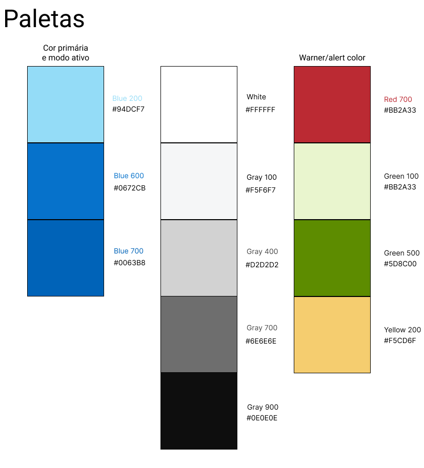

# WAD - Web Application Document - Módulo 2 - Inteli


## Delles

#### Nomes dos integrantes do grupo

- <a href="https://www.linkedin.com/in/felipe-simão-716a572b4">Felipe Freire Machado Simão</a>
- <a href="https://www.linkedin.com/in/gabriel-scarpelin-diniz-425258144">Gabriel Scarpelin Diniz</a>
- <a href="https://www.linkedin.com/in/leonardo-griner-477097277">Leonardo Griner</a>
- <a href="https://www.linkedin.com/in/lucasmaga00">Lucas Magalhães Castro Rodrigues</a>
- <a href="https://br.linkedin.com/in/mbepplerp">Mateus Beppler Pereira</a>
- <a href="https://www.linkedin.com/in/marcelo-conde-filho-3257702bb/">Marcelo Conde Filho</a>

## Sumário

[1. Introdução](#c1)

[2. Visão Geral da Aplicação Web](#c2)

[3. Projeto Técnico da Aplicação Web](#c3)

[4. Desenvolvimento da Aplicação Web](#c4)

[5. Testes da Aplicação Web](#c5)

[6. Conclusões e trabalhos futuros](#c6)

[7. Referências](#c7)

[Anexos](#c8)

<br>


# <a name="c1"></a>1. Introdução

&nbsp;&nbsp;&nbsp;&nbsp;A problemática trazida pelo parceiro de projeto, a Dell, nesse segundo módulo, é a dificuldade no treinamento de funcionários que trabalham nas linhas de montagem da fábrica da empresa. Essas dificuldades incluem a demora no aprendizado de processos específicos e também o obstáculo para os funcionários em se manterem atualizados sobre o conteúdo quando uma alteração ocorre ou novos manuais são incluídos. Esse problema engloba todas as linhas de montagem de todos os produtos fabricados pela empresa, como computadores pessoais, servidores, notebooks, dispositivos de armazenamento, switches de rede, PDAs, software, periféricos e mais.

&nbsp;&nbsp;&nbsp;&nbsp;A nossa solução para a problemática apresentada é única e extremamente eficiente. Iremos desenvolver uma aplicação web de treinamento individual para divulgar e disponibilizar materiais técnicos sobre o processo de montagem dos produtos da empresa parceira. Nossa aplicação web será capaz de disponibilizar diversos tipos de materiais, incluindo documentos, imagens, gravações de vídeo e modelos 3D, assim possibilitaremos que os funcionários explorem todos os detalhes de montagem. Para os administradores, nossa solução permitirá que visualizem as estatísticas de leitura e visualização dos funcionários de forma consolidada, para assim medir com sucesso o empenho de cada pessoa. Também por meio de e-mails e notificações na própria aplicação web, os funcionários serão avisados sobre melhorias nos processos de montagem, inclusão de novos manuais e atualizações.

&nbsp;&nbsp;&nbsp;&nbsp;Nossa solução é única e cria valor para o parceiro porque, com ela, nossa empresa parceira será capaz de diminuir o tempo de aprendizado de cada funcionário. Inclusive, com o conhecimento adquirido, os funcionários irão cometer menos erros, reduzindo assim o tempo de montagem dos produtos e aumentando a eficiência das linhas de montagem como um todo. Sem contar que, com menos erros, a empresa parceira aumentará seus lucros. Além disso, por meio da nossa aplicação web extremamente intuitiva, os funcionários poderão revisar e visualizar o processo de montagem constantemente, o que tornará o aprendizado como um todo mais rápido e fácil.


# <a name="c2"></a>2. Visão Geral da Aplicação Web

## 2.1. Escopo do Projeto

### 2.1.1. Contexto da indústria

&nbsp;&nbsp;&nbsp;&nbsp;A Dell Technologies enfrenta uma concorrência significativa com HP, Lenovo, IBM, Cisco Systems e Oracle, empresas líderes no mercado de tecnologia, a Dell opera com um modelo de negócio diversificado, oferecendo hardware, software e serviços para atender às demandas digitais dos clientes, focando em inovação contínua, investindo em pesquisa e desenvolvimento para manter sua posição como um dos principais fornecedores globais de soluções de TI. Em meio à intensa competição da indústria, a empresa busca atuar em diversos segmentos, tanto no mercado de pessoas físicas quanto no mercado empresarial. Em resumo, a Dell está inclusa no segmento de hardware e software, e por este motivo ocupa um setor concorrido e  abrangente da indústria, que impulsionam a eficiência e a inovação aos clientes.


### 2.1.2. Modelo de 5 Forças de Porter

&nbsp;&nbsp;&nbsp;&nbsp;A análise das Cinco Forças de Porter na Dell Inc. oferece uma visão essencial das dinâmicas competitivas que moldam seu ambiente operacional. Essa análise, criada por Michael E. Porter, examina a ameaça de novos entrantes, o poder de negociação dos fornecedores e dos clientes, a ameaça de produtos substitutos e a rivalidade entre concorrentes existentes, compreender essas forças é importante para a formulação de estratégias eficazes que mantenham a Dell competitiva no mercado de tecnologia em constante mudança. [¹](#c7)

<div align="center">
<sub>Figura 1 — 5 Forças de Porter</sub> </br>
<br>
<sup>Fonte: Material produzido pelos autores (2024).</sup>
</div><br>

[Link para leitura](https://miro.com/app/board/uXjVKTbfKSc=/?share_link_id=715291057354)

&nbsp;&nbsp;&nbsp;&nbsp;A análise das Cinco Forças de Porter destaca a importância de compreender as dinâmicas competitivas do mercado tecnológico, ao examinar elementos como ameaça de novos entrantes, poder de negociação dos fornecedores e clientes, ameaça de produtos substitutos e rivalidade entre concorrentes, a empresa pode formular estratégias eficazes para manter sua competitividade em um ambiente em constante evolução.

### 2.1.3. Análise SWOT

&nbsp;&nbsp;&nbsp;&nbsp;A análise SWOT é uma ferramenta chave na gestão empresarial, dividida em quatro aspectos: forças, fraquezas, oportunidades e ameaças, enquanto as duas primeiras dizem respeito ao ambiente interno, as duas últimas estão ligadas ao ambiente externo da empresa, essa ferramenta ajuda na identificação das vantagens competitivas internas e fatores externos que podem impactar o negócio, sendo crucial para a tomada de decisões a longo prazo.[²](#c7)

<div align="center">
<sub>Figura 2 — Análise SWOT </sub> </br>

<sup>Fonte: Material produzido pelos autores (2024).</sup>
</div><br>

[Link para leitura](https://www.figma.com/file/oE3f6vL0eIugE471wPUnB1/Untitled?type=whiteboard&node-id=0%3A1&t=eMBADijDXzWDvVyL-1)

&nbsp;&nbsp;&nbsp;&nbsp;Tendo em vista a análise SWOT da imagem acima, feita com base no artigo da SEBRAE[³](#c7), é importante observar alguns aspectos que se adequem ao propósito do projeto, principalmente pela falta de otimização nos treinamentos dos funcionários da linha de produção, o que gera um desequilíbrio em relação à concorrência. Dessa forma, é possível potencializar a força da Dell para atuar em diferentes mercados e ter uma linha de produção ainda mais eficiente no Brasil.


### 2.1.4. Solução:
**1. qual é o problema a ser resolvido:**<br>
&nbsp;&nbsp;&nbsp;&nbsp;O problema que nossa aplicação web resolverá é a dificuldade no treinamento de funcionários que trabalham nas linhas de montagem da empresa.<br>
&nbsp;&nbsp;&nbsp;&nbsp;Hoje temos o problema de novos funcionários não possuírem o aprendizado concentrado e específico dos processos de montagens e também a dificuldade de manter todos os funcionários atualizados caso alguma alteração seja feita no processo de montagem.<br>

**2. quais os dados disponíveis:**<br>
&nbsp;&nbsp;&nbsp;&nbsp;Não se aplica, pois a natureza sigilosa da fábrica impede nosso acesso aos dados necessários.<br>

**3. qual a solução proposta:**<br>
&nbsp;&nbsp;&nbsp;&nbsp;Uma aplicação web de treinamento individual para divulgar e disponibilizar materiais sobre o processo de montagem dos produtos. Nossa solução traz o aprendizado concentrado e específico dos processos de montagem para os novos funcionários e também, mantém todos funcionários atualizados por meio de notificações e e-mails caso haja alguma alteração nos manuais. <br>

**4. como a solução proposta deverá ser utilizada:**<br>
&nbsp;&nbsp;&nbsp;&nbsp;A maneira que a solução deve ser utilizada é integrando o sistema desenvolvido nos monitores que os empregados têm acesso em suas estações de trabalho, além de disponibilizar o acesso mobile para que os trabalhadores possam usar o site em seu próprio smartphone. Porém, ambas as alternativas devem ser limitadas ao uso dentro da fábrica, proibindo o uso fora de seus perímetros.<br>

**5. quais os benefícios trazidos pela solução proposta:**<br>
&nbsp;&nbsp;&nbsp;&nbsp;Os benefícios trazidos pela solução proposta são, uma maior eficiência e rapidez no processo de aprendizagem dos manuais pelos trabalhadores, além de um maior controle dos administradores/engenheiros sobre os empregados, permitindo à eles a delegação de manuais para os trabalhadores e linhas de produção. Por fim, um rápido envio de notificações para os funcionários, informando a ele a existência de um novo material.<br>

**6. qual será o critério de sucesso e qual medida será utilizada para o avaliar:**<br>
&nbsp;&nbsp;&nbsp;&nbsp;O critério de sucesso será feito baseado nos seguintes tópicos: agilidade na entrega da informação para o operador, controle da latência de atualização, notificação das atualizações dos conteúdos e qualidade dos feedbacks do cliente. Assim, comparando com os resultados prévios à integração de nossa solução e avaliando o seu sucesso ou o seu fracasso.

### 2.1.5. Proposta de Valor

&nbsp;&nbsp;&nbsp;&nbsp;O Canvas de Proposta de Valor é dividido em duas seções: perfil do cliente e mapa de valor, o perfil do cliente compreende tarefas, dores e ganhos, as tarefas são ações desejadas pelo cliente, as dores são obstáculos ou frustrações, e os ganhos são resultados positivos, o mapa de valor inclui o produto ou serviço oferecido, como ele resolve dores do cliente e gera ganhos.[⁴](#c7)

<div align="center">
<sub>Figura 3 — Canvas da Proposta de Valor</sub> </br>

<sup>Fonte: Material produzido pelos autores (2024).</sup>
</div><br>

&nbsp;&nbsp;&nbsp;&nbsp;Ao introduzir o Canvas, identificamos as dores principais, compreendendo essas questões e analisando detalhadamente o Canvas, desenvolvemos uma aplicação web que busca mitigar as dores dos funcionários da linha de produção da Dell, oferecendo uma solução eficaz e inovadora para o treinamento de funcionários, com a possibilidade de disponibilizar materiais técnicos sobre o processo de montagem dos produtos da empresa, além de notificações e e-mails para manter os funcionários atualizados sobre as mudanças nos manuais. Além disso, a solução busca ajudar os gestores no monitoramento e integração dos dados na plataforma.

### 2.1.6. Matriz de Riscos

&nbsp;&nbsp;&nbsp;&nbsp;A matriz de risco e oportunidade é uma ferramenta crucial para o gerenciamento estratégico, permitindo a identificação e avaliação sistemática dos riscos e oportunidades em diversos contextos. Essa análise é fundamental para antecipar desafios e aproveitar potenciais vantagens em ambientes competitivos. A matriz é desenvolvida através de uma metodologia rigorosa, que leva em consideração variáveis internas e externas, fornecendo uma visão compreensiva que suporta decisões informadas e a alocação eficiente de recursos. [⁵](#c7)

<div align="center">
<sub>Figura 4 — Matriz de Risco (Sprint 1)</sub>
 <br>
<sup>Fonte: Material produzido pelos autores (2024).</sup>
</div>

&nbsp;&nbsp;&nbsp;&nbsp;Com o desenvolvimento da matriz de risco e oportunidade, é possível traçar alguns planos de ação a fim de mitigar e planejar. A seguir, apresentamos os planos de ação desenhados para cada um dos riscos.

### Planos de ação contra Ameaças
**Complexidade da Plataforma**
* Entendimento amplo dos usuários para mitigar os problemas de intuitividade do sistema

**Integração com Sistemas Internos:**
* Buscar a melhor maneira de implementar no projeto buscando ajuda

**Falha na Escalabilidade:**
* Desenvolver a aplicação web para que aguente mais do que o necessário para garantir que não ficará sobrecarregado;

**Falta de materiais e dados:**
* A empresa compartilhar dados aproximados e arquivos que exemplifiquem os arquivos originais.

**Falhas de segurança na aplicação:**
* Implementar a aplicação com o auxílio de profissionais na área de cibersegurança.

**Resistência à mudança por parte dos funcionários:**
* Implementar um plano de comunicação e treinamento eficaz para garantir que os funcionários estejam cientes dos benefícios da nova aplicação e se sintam confortáveis com as mudanças.

**Falha na aceitação do usuário final:**
* Realizar testes de aceitação com os usuários finais em cada etapa do desenvolvimento, implementar feedbacks para garantir que a aplicação atenda às necessidades dos funcionários da linha de montagem.

**Problemas de desempenho da aplicação:**
* Realizar testes de carga e desempenho para identificar possíveis gargalos e otimizar o desempenho da aplicação e monitorar continuamente o desempenho após a implementação e estar preparado para ajustes conforme necessário.

<br>
&nbsp;&nbsp;&nbsp;&nbsp;A matriz de risco e oportunidade destacou oportunidades significativas para inovação e crescimento. Essas possibilidades emergem de uma análise detalhada do ambiente interno e externo, sugerindo estratégias para melhorar a competitividade e a eficiência operacional. A exploração dessas oportunidades é vital para adaptar-se e prosperar em mercados dinâmicos.

### Resultados das Oportunidades
**Optimização de dados e de acesso:**
* Simplificação do acesso dos manuais para os funcionários e dos dados dos trabalhadores.

**Velocidade de atualizações de Manuais**
* Um sistema de atualização dos manuais para os administradores de uma forma fácil e rápida ajudando na actualização de informações necessárias para os funcionários.

**Melhor desempenho dos funcionários**
* Os funcionários terão menos problemas com o processo de acesso para manuais e outros dados necessários para fazer seus trabalhos.

**Avanço no registros de Usuários e suas tarefas**
* Com a facilidade de acesso e atualizações junto com o sistema de dados dos funcionários a base dos manuais, os administradores terão mais controle sobre os funcionários e suas tarefas em relação ao aprendizado necessário.

## 2.2. Personas

&nbsp;&nbsp;&nbsp;&nbsp;Uma persona é um perfil semi-ficcional do cliente ideal, criado para representar segmentos distintos de um público-alvo. Ela serve para orientar o  desenvolvimento de produtos, assegurando que as decisões tomadas estejam alinhadas com as necessidades e comportamentos dos consumidores. Sua importância reside em aprimorar a comunicação e aumentar a eficácia da função dos produtos.

<div align="center">
<sub>Figura 5 — Persona Engenheiro </sub> </br>

<sup>Fonte: Material produzido pelos autores (2024).</sup>
</div><br>

<div align="center">
<sub>Figura 6 — Persona Operário</sub> </br>

<sup>Fonte: Material produzido pelos autores (2024).</sup>
</div><br>

&nbsp;&nbsp;&nbsp;&nbsp;O mapa de empatia é uma ferramenta visual que detalha a experiência do cliente através de seis categorias: o que eles pensam e sentem, veem, dizem e fazem, ouvem, além de seus desafios (dores) e objetivos (ganhos). Serve para aprofundar o entendimento sobre as necessidades e comportamentos dos clientes, facilitando a criação de produtos e estratégias de marketing mais eficazes. É essencial para construir uma conexão mais forte e empática com o público.

<div align="center">
<sub>Figura 7 — Mapa de Empatia - Persoana Engenheiro</sub> </br>

<sup>Fonte: Material produzido pelos autores (2024).</sup>
</div><br>

<div align="center">
<sub>Figura 8 — Mapa de Empatia - Persona Operário. </sub> </br>

<sup>Fonte: Material produzido pelos autores (2024).</sup>
</div><br>

&nbsp;&nbsp;&nbsp;&nbsp;Em suma, tanto a persona quanto o mapa de empatia são ferramentas cruciais no arsenal de marketing e desenvolvimento de produtos. Ao criar personas, as empresas podem visualizar e compreender melhor seus segmentos de clientes, enquanto o mapa de empatia permite explorar profundamente a experiência e as motivações dos consumidores. A combinação dessas ferramentas aprimora a precisão das estratégias de marketing e desenvolvimento, resultando em produtos que não apenas atendem às expectativas do consumidor, mas também ressoam em um nível emocional mais profundo. Assim, a adoção dessas técnicas contribui significativamente para o sucesso empresarial, fortalecendo a conexão com os clientes e otimizando a entrega de valor.

## 2.3. User Stories

&nbsp;&nbsp;&nbsp;&nbsp;A User Stories é uma ferramenta do desenvolvimento de software que busca principalmente pensar em novas funcionalidades da aplicação, do ponto de vista do usuário. Além disso, as User Stories promovem um maior valor agregado ao produto para o consumidor. Por outro lado, cada User Story precisa ser independente das outras, única e divisível. Com o andamento do projeto, as User Stories - que são as funcionalidades requeridas pensadas a partir da perspectiva do cliente - são divididas em tarefas menores e distribuídas entre a equipe até chegar a conclusão da mesma. [⁶](#c7)

 <div align="center">Tabela 1 - User Stories</div>

<table class="tg">
<thead>
  <tr>
    <th class="tg-0pky">Número</th>
    <td class="tg-0pky" colspan="2">US01</th>
  </tr>
</thead>
<tbody>
  <tr>
    <th class="tg-0pky">Título</td>
    <td class="tg-0pky" colspan="2">Processo de cadastro do montador</td>
  </tr>
  <tr>
    <th class="tg-0pky">Persona</td>
    <td class="tg-0pky" colspan="2">Carlos Mintin</td>
  </tr>
  <tr>
    <th class="tg-0pky">História</td>
    <td class="tg-0pky" colspan="2">Enquanto montador, quero que seja possível me cadastrar para que eu consiga ter acesso à minha conta pessoal de membro, com tarefas e manuais personalizados para mim.</td>
  </tr>
  <tr>
    <th class="tg-0pky">Critérios de aceitação</td>
    <td class="tg-0pky">1)O e-mail utilizado para se cadastrar é da equipe da Dell?</td>
    <td class="tg-0pky">2)A senha contém a quantidade mínima de sete caracteres?</td>
  </tr>
  <tr>
    <th class="tg-0pky">Testes de aceitação</td>
    <td class="tg-0pky">1)Sim. O cadastro é possível.<br>Não. O cadastro não é possível.</td>
    <td class="tg-0pky">2)Sim. O cadastro é possível.<br>Não. O cadastro não é possível.</td>
  </tr>
</tbody>
</table>

<table class="tg">
<thead>
  <tr>
    <th class="tg-0pky">Número</th>
    <td class="tg-0pky" colspan="2">US02</th>
  </tr>
</thead>
<tbody>
  <tr>
    <th class="tg-0pky">Título</td>
    <td class="tg-0pky" colspan="2">Processo de cadastro do administrador</td>
  </tr>
  <tr>
    <th class="tg-0pky">Persona</td>
    <td class="tg-0pky" colspan="2">Geraldo Pereira da Silva</td>
  </tr>
  <tr>
    <th class="tg-0pky">História</td>
    <td class="tg-0pky" colspan="2">Enquanto administrador, quero que seja possível me cadastrar para que eu consiga ter acesso à minha conta pessoal de administrador, com a capacidade de delegar tarefas e editar os manuais.</td>
  </tr>
  <tr>
    <th class="tg-0pky">Critérios de aceitação</td>
    <td class="tg-0pky">1)O usuário consegue acessar a página de cadastro?</td>
    <td class="tg-0pky">2)O email utilizado é o de um administrador?</td>
  </tr>
  <tr>
    <th class="tg-0pky">Testes de aceitação</td>
    <td class="tg-0pky">1) Sim, o cadastro é possível.<br>Não, o cadastro não é possível</td>
    <td class="tg-0pky">2) Sim, o cadastro de administrador é possível.<br>Não, o cadastro de administrador não é possível.</td>
  </tr>
</tbody>
</table>

<table class="tg">
<thead>
  <tr>
    <th class="tg-0pky">Número</th>
    <td class="tg-0pky" colspan="2">US03</th>
  </tr>
</thead>
<tbody>
  <tr>
    <th class="tg-0pky">Título</td>
    <td class="tg-0pky" colspan="2">Disponibilização de catálogo de manuais</td>
  </tr>
  <tr>
    <th class="tg-0pky">Persona</td>
    <td class="tg-0pky" colspan="2">Geraldo Pereira da Silva</td>
  </tr>
  <tr>
    <th class="tg-0pky">História</td>
    <td class="tg-0pky" colspan="2">Enquanto administrador, quero que seja possível adicionar um catálogo de manuais, para que seja mais fácil para os montadores encontrarem os manuais desejados.</td>
  </tr>
  <tr>
    <th class="tg-0pky">Critérios de aceitação</td>
    <td class="tg-0pky">1) O usuário consegue chegar na tela de manuais sem nenhum problema?</td>
    <td class="tg-0pky">2) Os manuais estão públicos e com as versões corretas?</td>
  </tr>
  <tr>
    <th class="tg-0pky">Testes de aceitação</td>
    <td class="tg-0pky">1)Sim, o administrador será capaz de registrar o manual.<br>Não, o administrador não conseguirá registrar o manual.</td>
    <td class="tg-0pky">2)Sim, o catálogo deste manual estará disponível.<br>Não, o catálogo de manuais estará privado à pessoas com acesso.</td>
  </tr>
</tbody>
</table>

<table class="tg">
<thead>
  <tr>
    <th class="tg-0pky">Número</th>
    <td class="tg-0pky" colspan="2">US04</th>
  </tr>
</thead>
<tbody>
  <tr>
    <th class="tg-0pky">Título</td>
    <td class="tg-0pky" colspan="2">Disponibilização de manuais a serem estudados para os montadores</td>
  </tr>
  <tr>
    <th class="tg-0pky">Persona</td>
    <td class="tg-0pky" colspan="2">Geraldo Pereira da Silva</td>
  </tr>
  <tr>
    <th class="tg-0pky">História</td>
    <td class="tg-0pky" colspan="2">Enquanto administrador, quero que eu seja capaz de atribuir manuais a serem estudados para os montadores, separando por linha de montagem ou individualmente, para que assim eu consiga deixar-los preparados com os manuais necessários para eles no momento.</td>
  </tr>
  <tr>
    <th class="tg-0pky">Critérios de aceitação</td>
    <td class="tg-0pky">1) O montador existe?</td>
    <td class="tg-0pky">2) A equipe existe?</td>

  </tr>
  <tr>
    <th class="tg-0pky">Testes de aceitação</td>
    <td class="tg-0pky">1) Sim. Atribuir os manuais para os montadores correspondentes.<br>Não. Um erro deve ser apresentado por não existir montador.</td>
    <td class="tg-0pky">2) Sim. O manual deve ser atribuído às equipes de montagem.<br>Não. Um erro deve ser apresentado por não existir equipe correspondente.</td>
  </tr>
</tbody>
</table>

<table class="tg">
<thead>
  <tr>
    <th class="tg-0pky">Número</th>
    <td class="tg-0pky" colspan="2">US05</th>
  </tr>
</thead>
<tbody>
  <tr>
    <th class="tg-0pky">Título</td>
    <td class="tg-0pky" colspan="2">Busca de materiais</td>
  </tr>
  <tr>
    <th class="tg-0pky">Persona</td>
    <td class="tg-0pky" colspan="2">Carlos Mintin</td>
  </tr>
  <tr>
    <th class="tg-0pky">História</td>
    <td class="tg-0pky" colspan="2">Enquanto montador, quero que seja possível fazer busca de manuais, para que eu encontre o manual que eu desejo estudar.</td>
  </tr>
  <tr>
    <th class="tg-0pky">Critérios de aceitação</td>
    <td class="tg-0pky">1) O manual existe no banco de dados?</td>
    <td class="tg-0pky">2) O manual está como visível para o gestor atual?</td>
  </tr>
  <tr>
    <th class="tg-0pky">Testes de aceitação</td>
    <td class="tg-0pky">1) Sim. Exibir o manual procurado pelo montador<br>Não. Exibir uma mensagem de que nenhum manual foi encontrado.</td>
    <td class="tg-0pky">2) Sim. Exibir o manual atual para o gestor.<br>Não. Exibir que o manual não foi encontrado.</td>
  </tr>
</tbody>
</table>

<table class="tg">
<thead>
  <tr>
    <th class="tg-0pky">Número</th>
    <td class="tg-0pky" colspan="2">US06</td>
  </tr>
</thead>
<tbody>
  <tr>
    <th class="tg-0pky">Título</th>
    <td class="tg-0pky" colspan="2">Adicionar manuais à lista de favoritos</td>
  </tr>
  <tr>
    <th class="tg-0pky">Persona</th>
    <td class="tg-0pky" colspan="2">Carlos Mintin</td>
  </tr>
  <tr>
    <th class="tg-0pky">História</th>
    <td class="tg-0pky" colspan="2">Enquanto montador, quero que seja possível adicionar manuais à minha lista de favoritos, para que eu consiga me organizar melhor ao favoritar os manuais que eu penso serem importantes para mim.</td>
  </tr>
  <tr>
    <th class="tg-0pky">Critérios de aceite</th>
    <td class="tg-0pky">1) O manual já foi concluído?</td>
    <td class="tg-0pky"></td>
  </tr>
  <tr>
    <th class="tg-0pky">Testes de aceitação</th>
    <td class="tg-0pky">1)Sim, é possível adicioná-lo à lista de favoritos.</td>
    <td class="tg-0pky">1)Não, não é possível adicioná-lo à lista de favoritos.</td>
  </tr>
</tbody>
</table>

<table class="tg">
<thead>
  <tr>
    <th class="tg-0pky">Número</th>
    <td class="tg-0pky" colspan="2">US07</td>
  </tr>
</thead>
<tbody>
  <tr>
    <th class="tg-0pky">Título</th>
    <td class="tg-0pky" colspan="2">Receber notificação para se manter atualizado do processo</td>
  </tr>
  <tr>
    <th class="tg-0pky">Persona</th>
    <td class="tg-0pky" colspan="2">Carlos Mintin</td>
  </tr>
  <tr>
    <th class="tg-0pky">História</th>
    <td class="tg-0pky" colspan="2">Como montador da fábrica eu desejo receber notificações avisando sobre atualizações nos manuais dos produtos, para que eu possa me manter atualizado e melhorar a eficiência na aprendizagem no processo de montagem</td>
  </tr>
  <tr>
    <th class="tg-0pky">Critérios de aceite</th>
    <td class="tg-0pky">1) O manual foi atualizado?</td>
    <td class="tg-0pky">2) Deve receber a notificação somente do manual que lhe foi atribuido</td>
  </tr>
  <tr>
    <th class="tg-0pky">Testes de aceitação</th>
    <td class="tg-0pky">1) Sim. Enviar a notificação para a plataforma.<br>Não. A plataforma não deve enviar notificações</td>
    <td class="tg-0pky">2) Sim. Estou recebendo a notificação de manuais atribuídos à mim.<br>Não. Estou recebendo notificação de outros manuais.</td>
  </tr>
</tbody>
</table>
<table class="tg">
<thead>
  <tr>
    <th class="tg-0pky">Número</th>
    <td class="tg-0pky" colspan="2">US08</td>
  </tr>
</thead>
<tbody>
  <tr>
    <th class="tg-0pky">Título</th>
    <td class="tg-0pky" colspan="2">Exibir informações de cada manual</td>
  </tr>
  <tr>
    <th class="tg-0pky">Persona</th>
    <td class="tg-0pky" colspan="2">Geraldo Pereira da Silva</td>
  </tr>
  <tr>
    <th class="tg-0pky">História</th>
    <td class="tg-0pky" colspan="2">Como gestor eu quero acessar todas as informações do manual de cada produto, porque ele precisa se manter atualizado sobre as informações de cada produto, para verificar informações sobre todas as peças</td>
  </tr>
  <tr>
    <th class="tg-0pky">Critérios de aceite</th>
    <td class="tg-0pky">1) Tem a regra de administrador no perfil?</td>
    <td class="tg-0pky">2) Usuário tem token de login válido?</td>
  </tr>
  <tr>
    <th class="tg-0pky">Testes de aceitação</th>
    <td class="tg-0pky">1) Sim. Pode acessar o manual de qualquer produto.<br>Não. Pode acessar apenas as informações dos manuais atribuídos para ele ou públicos</td>
    <td class="tg-0pky">2) Sim. Pode acessar os conteúdos.<br>Não. Não pode acessar o conteúdo e deve ser redirecionado para a página de login.</td>
  </tr>
</tbody>
</table>

<table class="tg">
<thead>
  <tr>
    <th class="tg-0pky">Número</th>
    <td class="tg-0pky" colspan="2">US09</td>
  </tr>
</thead>
<tbody>
  <tr>
    <th class="tg-0pky">Título</th>
    <td class="tg-0pky" colspan="2">Incluir arquivos PDFs, vídeos e impressões 3D</td>
  </tr>
  <tr>
    <th class="tg-0pky">Persona</th>
    <td class="tg-0pky" colspan="2">Geraldo Pereira da Silva</td>
  </tr>
  <tr>
    <th class="tg-0pky">História</th>
    <td class="tg-0pky" colspan="2">Como gestor eu quero incluir os manuais, com PDFs, imagens, vídeos, impressões 3D, etc, porque desse modo minha equipe consegue visualizar cada processo da montagem do produto e estudar com profundidade</td>
  </tr>
  <tr>
    <th class="tg-0pky">Critérios de aceite</th>
    <td class="tg-0pky">1) Tem a regra de administrador no perfil?</td>
    <td class="tg-0pky">2) O manual já existe para o modelo selecionado?</td>
  </tr>
  <tr>
    <th class="tg-0pky">Testes de aceitação</th>
    <td class="tg-0pky">1) Sim. Pode incluir o manual do produto.<br>Não. Não deve conseguir incluir manual de produtos</td>
    <td class="tg-0pky">2) Sim. Incluir uma nova versão de manual, guardando a versão antiga.<br>Não. Um primeiro manual para aquele modelo deve ser adicionado.</td>
  </tr>
</tbody>
</table>

<table class="tg">
<thead>
  <tr>
    <th class="tg-0pky">Número</th>
    <td class="tg-0pky" colspan="2">US10</td>
  </tr>
</thead>
<tbody>
  <tr>
    <th class="tg-0pky">Título</th>
    <td class="tg-0pky" colspan="2">Marcar manuais como lidos</td>
  </tr>
  <tr>
    <th class="tg-0pky">Persona</th>
    <td class="tg-0pky" colspan="2">Carlos Mintin</td>
  </tr>
  <tr>
    <th class="tg-0pky">História</th>
    <td class="tg-0pky" colspan="2">Como montador da fábrica eu desejo marcar os manuais como lidos para que eu possa controlar o conteúdo já estudado</td>
  </tr>
  <tr>
    <th class="tg-0pky">Critérios de aceite</th>
    <td class="tg-0pky">1) O manual já foi marcado como lido?</td>
    <td class="tg-0pky">2) Quando entro no sistema, consigo visualizar os manuais já lidos?</td>
  </tr>
  <tr>
    <th class="tg-0pky">Testes de aceitação</th>
    <td class="tg-0pky">1) Sim. Não deve ser possível marcar novamente e ele deve estar separado dos demais.<br>Não. O manual deve ser marcado como lido e separado dos demais.</td>
    <td class="tg-0pky">2) Sim. O manual está devidamente marcado como lido.<br>Não. Os manuais aparecem de forma bagunçada e não é possível separar os que já foram lidos.</td>
  </tr>
</tbody>
</table>

<table class="tg">
<thead>
  <tr>
    <th class="tg-0pky">Número</th>
    <td class="tg-0pky" colspan="2">US11</td>
  </tr>
</thead>
<tbody>
  <tr>
    <th class="tg-0pky">Título</th>
    <td class="tg-0pky" colspan="2">Visualizar estatísticas</td>
  </tr>
  <tr>
    <th class="tg-0pky">Persona</th>
    <td class="tg-0pky" colspan="2">Geraldo Pereira da Silva</td>
  </tr>
  <tr>
    <th class="tg-0pky">História</th>
    <td class="tg-0pky" colspan="2">Eu como gestor, quero acessar as estatísticas dos funcionários como os manuais que eles precisam ler, os manuais pendentes, etc. Podendo filtrar por funcionário e por equipe de funcionário</td>
  </tr>
  <tr>
    <th class="tg-0pky">Critérios de aceite</th>
    <td class="tg-0pky">1) Tem a regra de administrador no perfil?</td>
    <td class="tg-0pky">2) A <i>dashboard</i> é interativa, de fácil visualização e com filtros funcionais?</td>
  </tr>
  <tr>
    <th class="tg-0pky">Testes de aceitação</th>
    <td class="tg-0pky">1) Sim. Deve conseguir acessar a página de <i>dashboard</i>.<br>Não. O <i>dashboard</i> deve estar bloqueado para acesso.</td>
    <td class="tg-0pky">2) Sim. Os filtros são funcionais.<br>Não. A página não tem filtro e/ou não são funcionais.</td>
  </tr>
</tbody>
</table>

<table class="tg">
<thead>
  <tr>
    <th class="tg-0pky">Número</th>
    <td class="tg-0pky" colspan="2">US12</td>
  </tr>
</thead>
<tbody>
  <tr>
    <th class="tg-0pky">Título</th>
    <td class="tg-0pky" colspan="2">Visualizar feedbacks/reportes de erros</td>
  </tr>
  <tr>
    <th class="tg-0pky">Persona</th>
    <td class="tg-0pky" colspan="2">Geraldo Pereira da Silva</td>
  </tr>
  <tr>
    <th class="tg-0pky">História</th>
    <td class="tg-0pky" colspan="2">Eu como gestor quero visualizar os feedbacks/reportes de erros dos montadores para que eu possa observar melhorias nos manuais e entender melhor a minha equipe</td>
  </tr>
  <tr>
    <th class="tg-0pky">Critérios de aceite</th>
    <td class="tg-0pky">1) O gestor acessa a interface de feedback/reporte de erro?</td>
    <td class="tg-0pky">2) A interface exibe uma lista com todos os feedbacks/reporte de erro?</td>
  </tr>
  <tr>
    <th class="tg-0pky">Testes de aceitação</th>
    <td class="tg-0pky">1) Sim. O gestor acessa a interface de feedback/reporte de erro.</td>
    <td class="tg-0pky">2) Sim. A interface exibe uma lista com todos os feedbacks/reporte de erro.</td>
  </tr>
</tbody>
</table>


<table class="tg">
<thead>
  <tr>
    <th class="tg-0pky">Número</th>
    <td class="tg-0pky" colspan="2">US13</td>
  </tr>
</thead>
<tbody>
  <tr>
    <th class="tg-0pky">Título</th>
    <td class="tg-0pky" colspan="2">Reportar um erro em um manual</td>
  </tr>
  <tr>
    <th class="tg-0pky">Persona</th>
    <td class="tg-0pky" colspan="2">Carlos Mintin</td>
  </tr>
  <tr>
    <th class="tg-0pky">História</th>
    <td class="tg-0pky" colspan="2">Eu como montador quero reportar erros e pontuar melhorias nos manuais, para que eu possa entregar um melhor serviço na linha de montagem e aumentar a eficiência</td>
  </tr>
  <tr>
    <th class="tg-0pky">Critérios de aceite</th>
    <td class="tg-0pky">1) O montador acessa a interface do sistema?</td>
    <td class="tg-0pky">2) O montador navega até a seção de reporte de erros/sugestões?</td>
  </tr>
  <tr>
    <th class="tg-0pky">Testes de aceitação</th>
    <td class="tg-0pky">1) Sim. O montador acessa a interface do sistema.</td>
    <td class="tg-0pky">2) Sim. O montador navega até a seção de acompanhamento de reportes.</td>
  </tr>
</tbody>
</table>

<div align="center">Fonte: Material produzido pelos autores (2024).</div>
&nbsp;&nbsp;&nbsp;&nbsp; Ao analisar as User Stories, podemos consolidar o que o usuário irá fazer com a nossa aplicação WEB e os possíveis erros que podem vir com esses inputs. O motivo pelo qual isso é importante para o projeto do grupo, se baseia na facilidade promovida por essa ferramenta que, futuramente, irá ajudar muito na integração de novos elementos na aplicação WEB devido, principalmente à conscientização do grupo acerca dos critérios de aceitação e os testes para aprovar os mesmos.

# <a name="c3"></a>3. Projeto da Aplicação Web

## 3.1. Arquitetura


&nbsp;&nbsp;&nbsp;&nbsp;A aplicação web utilizará a arquitetura MVC (*Model-View-Controller*). O *Model* contém as regras de negócio e acessa o banco de dados, o *Controller* intermedia entre *Model* e *View*, e a *View* exibe as informações ao usuário. Essa arquitetura facilita a manutenção e evolução do sistema, promovendo organização, modularidade e reutilização de código, além de melhorar a integração e escalabilidade. No entanto, pode aumentar a complexidade inicial para desenvolvedores iniciantes.

&nbsp;&nbsp;&nbsp;&nbsp;Os modelos do sistema incluem: *Users*, *Manuals*, *Models*, *MounterTeams*, *Tasks* e *Favorites*. Os controladores correspondentes são: *UsersController*, *ManualsController*, *ModelsController*, *MounterTeamsController*, *TasksController* e *FavoritesController*. As *Views* são divididas entre *Admin* e *User*, permitindo acesso específico para administradores e montadores.

&nbsp;&nbsp;&nbsp;&nbsp;As tecnologias usadas são: *HTML*, *CSS* e *JavaScript* para a interface visual, *Node.js* para o back-end, *Express* para rotas, *SailsJS* para a criação de APIs e aplicação do MVC, *Postgres* para o banco de dados, e *EJS* para páginas web dinâmicas. O *DBeaver* será utilizado para gerenciar e manipular o banco de dados eficientemente.

<div align="center">
<sub>Figura 9 — Arquitetura MVC. </sub> </br>

<sup>Fonte: Material produzido pelos autores (2024).</sup>
</div><br>

&nbsp;&nbsp;&nbsp;&nbsp;Para complementar a explicação do framework *Sails*, será utilizado o *routes.js*, responsável por definir as rotas da aplicação, facilitando a gestão e organização dos caminhos acessados pelos usuários.

[Link para Leitura](https://www.figma.com/file/YKlBJpu9FCqAAD5nKheToF/MVCProjectt?type=whiteboard&node-id=0-1&t=fuHL6gFvM1D7oHUb-0)


## 3.2. Wireframes
&nbsp;&nbsp;&nbsp;&nbsp;Wireframes são ferramentas fundamentais no início do desenvolvimento de sites e aplicativos, eles funcionam como diagramas que delineiam a disposição básica dos elementos de interface, como menus, botões, imagens e blocos de texto. [⁸](#c8)

<div align="center">
<sub>Figura 10 — Wireframe Montador. </sub> </br>
<br>
<sup>Fonte: Material produzido pelos autores (2024).</sup>
</div><br>

<div align="center">
<sub>Figura 11 — Wireframe Engenheiro. </sub> </br>
<br>
<sup>Fonte: Material produzido pelos autores (2024).</sup>
</div><br>

[Link para Leitura](https://www.figma.com/file/5Jyah9poKh8vOpjvLc8h8k/Wireframe---Artefato-3?type=design&node-id=0-1&mode=design)

&nbsp;&nbsp;&nbsp;&nbsp;No Desenvolvimento do nosso wireframe, trouxemos duas *User Stories* principais para o projeto, uma é sobre o montador acessando um manual e a segunda do engenheiro acessando a página para cadastro de um manual, o desenvolvimento do wireframe é muito importante para a construção do projeto, pois com ele podemos desenvolver as funcionalidades da nossa aplicação em baixa fidelidade, para que em próximos passos possamos avançar em seu design.

## 3.3. Guia de estilos

&nbsp;&nbsp;&nbsp;&nbsp;Para garantir uma aplicação web consistente e visualmente atraente, é crucial seguir um guia de estilos bem definido. Nosso guia de estilos, inspirado no site Dell Design System, fornece diretrizes específicas sobre cores, tipografia, iconografia e imagens.

&nbsp;&nbsp;&nbsp;&nbsp;Sobre as cores, buscamos consistência e contraste. Usamos uma paleta de cores inspirada no site Dell Design System definida para manter a consistência visual em toda a aplicação. Cada cor foi escolhida para refletir em perfeição o que foi pedido pelo nosso parceiro. Também é importante ter certeza de que haja contraste suficiente entre o texto e o fundo para garantir a legibilidade. Isso é especialmente importante em botões e links para que se destaquem na interface.

&nbsp;&nbsp;&nbsp;&nbsp;Sobre a tipografia, buscamos manter uma certa hierarquia para os tamanhos diferentes de fonte. Buscamos estabelecer uma clara organização de informação. Textos maiores para títulos e subtítulos e tamanhos menores para conteúdo de corpo garantem uma leitura fluida e organizada. E sobre as fontes, também buscamos manter ao máximo a fidelidade ao site Dell Design System, por isso, nosso parceiro nos forneceu as fontes e toda nossa tipografia utiliza das fontes fornecidas.

&nbsp;&nbsp;&nbsp;&nbsp;E para finalizar, nossa iconografia e imagens também foram fornecidas pelo parceiro Dell Technologies e nosso objetivo é manter um estilo consistente para todas as imagens e ícones. Isso ajuda a criar um ambiente visual coeso que os usuários reconhecem e entendem rapidamente. Também utilizamos imagens e ícones de alta qualidade para evitar pixelização e outros problemas de visualização que podem prejudicar a aparência da aplicação.

&nbsp;&nbsp;&nbsp;&nbsp;Abaixo segue o _link_ para visualizar o nosso guia de estilos desenvolvido para o projeto:

[Link para Leitura](https://www.figma.com/design/XtrJgIQKk69WMyOdR8i1QW/Design?node-id=2102-2&t=amthtTv1SZlx6xWf-0)

&nbsp;&nbsp;&nbsp;&nbsp;Adotando essas práticas, somos capazes de manter a integridade visual da marca e também melhorar a usabilidade e a experiência geral do usuário em nossa aplicação web.

### 3.3.1 Cores

&nbsp;&nbsp;&nbsp;&nbsp;Abaixo estão as diversas cores que serão usadas na aplicação _WEB_ produzida pela nossa equipe para que alcancemos contraste suficiente entre o texto e o fundo garantindo assim legibilidade por parte do usuário, além de manter a identidade visual da Dell.[⁹](#c9)

<div align="center">
<sub>Figura 12: Paleta de cores</sub> <br>
<br>
<sup>Fonte: Material produzido pelos autores (2024).</sup>
</div>

&nbsp;&nbsp;&nbsp;&nbsp;Sobre o uso das cores apresentadas na paleta de cores, as cores azuis são usadas na grande maioria das interações com o usuário, por exemplo, nos botões do site, links, entre outros. As cores que estão no meio da paleta são as cores usadas para os fundos principais da tela, os fundos secundários e o _Gray 900_ que é usado como cor da fonte para os textos na aplicação _WEB_. Por fim, a cor _Red 700_ será usada para os alertas necessários, como as notificações recebidas e para indicar quais são os manuais pendentes.

### 3.3.2 Tipografia
&nbsp;&nbsp;&nbsp;&nbsp;A escolha da tipografia para nosso projeto é baseada nas fontes especificadas no site da Dell, que define as diretrizes para a padronização de nossa aplicação WEB com o "dellsignsystem".[¹⁰](#c10) A consistência na tipografia é fundamental para garantir que a aplicação seja visualmente atraente e fácil de ler, garantindo que os usuários consigam visualizar as informações de forma clara e com uma hierarquia bem definida.

<div align="center">
<sub>Figura 13: Exemplo de tipografia do Dell Design System - Página sobre tipografia</sub>
<br>
<sup>Fonte: Dell Sign System</sup>
</div>


### 3.3.3 Iconografia e imagens

&nbsp;&nbsp;&nbsp;&nbsp;A escolha da iconografia para nosso projeto foi realizada com base nos ícones disponibilizados pela Dell, que define as diretrizes para a padronização de nossa aplicação WEB com o "dellsignsystem".[¹¹](#c11).

<div align="center">
<sub>Figura 14: Iconografia do Dell Design System</sub>
<br>
<sup>Fonte: Dell Sign System</sup>
</div>

## 3.4 Protótipo de alta fidelidade

&nbsp;&nbsp;&nbsp;&nbsp;A partir do desenvolvimento do nosso _Wireframe_ partimos para o processo de desenvolvimento da prototipação de alta fidelidade do projeto, seguimos rigorosamente o nosso guia de estilos e todas as regras de estilização disponibilizados pela Dell.

<div align="center">
<sub>Figura 15: Protótipo de alta fidelidade - Login Computador</sub>
<br>
<sup>Fonte: Material produzido pelos autores (2024).</sup>
</div>

&nbsp;&nbsp;&nbsp;&nbsp;Para desenvolvermos a tela de login buscamos trazer os campos de forma minimalista e intuitiva, com os campos para inserir o e-mail e a senha para entrar na plataforma, além disso trouxemos os campos "Esqueceu sua senha?" para redefinição da senha do usuários e "Não tem cadastro?" para cadastrar um novo usuário.

<div align="center">
<sub>Figura 16: Protótipo de alta fidelidade - Dashboard do Admin Computador</sub>
<br>
<sup>Fonte: Material produzido pelos autores (2024).</sup>
</div>

&nbsp;&nbsp;&nbsp;&nbsp;Para construirmos o dashboard do administrador trouxemos todos os dados solicitados pelo nosso parceiro, possibilitando a visualização dos manuais realizados ou não por cada montador ou por cada linha de montagem.

<div align="center">
<sub>Figura 17: Protótipo de alta fidelidade - Página de busca Computador</sub>
<br>
<sup>Fonte: Material produzido pelos autores (2024).</sup>
</div>

&nbsp;&nbsp;&nbsp;&nbsp;Desenvolvemos a página de forma intuitiva trazendo um campo de busca principal que irá buscar todos os manuais e entregar para o usuário, posicionamos um filtro lateral, dessa forma deixando a busca mais dinâmica e intuitiva.

<div align="center">
<sub>Figura 18: Protótipo de alta fidelidade - Cadastro do manual Computador</sub>
<br>
<sup>Fonte: Material produzido pelos autores (2024).</sup>
</div>

&nbsp;&nbsp;&nbsp;&nbsp;Essa página só o administrador terá a permissão de acessá-la, assim possibilitando o cadastro de novos manuais ao sistema.

<div align="center">
<sub>Figura 19: Protótipo de alta fidelidade - Página do Manual Computador</sub>
<br>
<sup>Fonte: Material produzido pelos autores (2024).</sup>
</div>

&nbsp;&nbsp;&nbsp;&nbsp;Para construirmos a página do manual, adicionamos todas as informações importantes para cada manual, listando a versão, modelo, descrição e os seus respectivos arquivos, possibilitando que o usuário adicione este manual na sua aba de favoritos, além disso também é possível reportar um erro encontrado no manual.

<div align="center">
<sub>Figura 20: Protótipo de alta fidelidade - Perfil Computador</sub>
<br>
<sup>Fonte: Material produzido pelos autores (2024).</sup>
</div>

&nbsp;&nbsp;&nbsp;&nbsp;Para construirmos a página do manual, trouxemos todas as informações do usuário, trazendo a possibilidade dele alterar a sua foto de perfil.

<div align="center">
<sub>Figura 21: Protótipo de alta fidelidade - Atribuição de Tarefas Computador</sub>
<br>
<sup>Fonte: Material produzido pelos autores (2024).</sup>
</div>

&nbsp;&nbsp;&nbsp;&nbsp;Nessa página somente o administrador tem permissão de acesso, onde vai ser possível atribuir um manual específico a um montador ou a uma linha de montagem, desta forma atribuindo a todos os montadores desta linha de montagem selecionada.

<div align="center">
<sub>Figura 22: Protótipo de alta fidelidade - Atualização da linha de montagem Computador</sub>
<br>
<sup>Fonte: Material produzido pelos autores (2024).</sup>
</div>

&nbsp;&nbsp;&nbsp;&nbsp;Nessa página somente o administrador tem permissão de acesso, nela é possível atribuir um funcionário a uma linha específica, dessa forma dividindo em várias equipes de acordo com a linha de montagem selecionada.

<div align="center">
<sub>Figura 23: Protótipo de alta fidelidade -  Dashboard do Montador Computador</sub>
<br>
<sup>Fonte: Material produzido pelos autores (2024).</sup>
</div>

&nbsp;&nbsp;&nbsp;&nbsp;Essa página representa o _dashboard_ do montador, possibilitando a visualização dos manuais atribuídos a ele, e os manuais já concluídos, adicionamos os manuais pendentes a esquerda da página no computador, para dar um maior destaque a essa informação, já no celular a fim de trazer maior ênfase a essa informação posicionamos os manuais pendentes em cima.


<div align="center">
<sub>Figura 24: Protótipo de alta fidelidade - Página de Manuais Favoritos Computador</sub>
<br>
<sup>Fonte: Material produzido pelos autores (2024).</sup>
</div>

&nbsp;&nbsp;&nbsp;&nbsp;Nesta página é disponibilizado para o montador todos os manuais que ele marcou como favoritos, possibilitando ao montador a funcionalidade de priorizar os manuais de maior acesso.

<div align="center">
<sub>Figura 25: Protótipo de alta fidelidade - Página de Suporte Computador</sub>
<br>
<sup>Fonte: Material produzido pelos autores (2024).</sup>
</div>

&nbsp;&nbsp;&nbsp;&nbsp;Está página foi construida e pensada especificamente para o montador, onde de forma intuitiva possibilita que ele notifique uma assistência ao administrador responsável, dessa forma possibilitando um auxílio mais eficiente na resolução de problemas e dúvidas.


<div align="center">
<sub>Figura 26: Protótipo de alta fidelidade - Redefinir a Senha Computador</sub>
<br>
<sup>Fonte: Material produzido pelos autores (2024).</sup>
</div>

&nbsp;&nbsp;&nbsp;&nbsp;Para desenvolvermos esta página pensamos na necessidade do usuário da nossa aplicação esquecer a sua senha e necessitar de uma atualização, dessa forma evitando que o funcionário fique sem trabalhar durante este período.

<div align="center"><sub>Figura 27: Cadastro de novos modelos</sub></div>
<div align="center"></div>
<div align="center"><sup>Fonte: Material produzido pelos autores (2024).</sup></div>

&nbsp;&nbsp;&nbsp;&nbsp;Está página foi pensada para melhorar a usabilidade do usuário administrador na nossa aplicação de cadastrar novos modelos de manual, dessa forma facilitando a utilização do administrador ao cadastrar modelos de manual, aumentando a eficácia do trabalho.

<div align="center"><sub>Figura 28: Cadastro de novas equipes</sub></div>
<div align="center"></div>
<div align="center"><sup>Fonte: Material produzido pelos autores (2024).</sup></div>

&nbsp;&nbsp;&nbsp;&nbsp;Para a criação dessa página pensamos na necessidade do usuário da nossa aplicação de cadastrar uma nova equipe de montadores pela aplicação WEB, assim, aumentando a produtividade fazendo esse processo tecnologicamente.

<div align="center"><sub>Figura 29: Listar montadores</sub></div>
<div align="center"></div>
<div align="center"><sup>Fonte: Material produzido pelos autores (2024).</sup></div>

&nbsp;&nbsp;&nbsp;&nbsp;A página foi criada no intuito do usuário administrador da nossa aplicação conseguir listar os montadores em uma tela, dessa forma economizando tempo sem precisar fazê-lo um montador a cada vez.

&nbsp;&nbsp;&nbsp;&nbsp;Abaixo se encontra o link para uma melhor visualização/leitura do nosso protótipo de alta fidelidade na versão para computador:

[Protótipo de alta fidelidade - Computador](https://www.figma.com/design/XtrJgIQKk69WMyOdR8i1QW/Design?node-id=2001-405&t=j208GtYhkxwNMlQC-0)

&nbsp;&nbsp;&nbsp;&nbsp;O desenvolvimento do nosso protótipo de alta fidelidade permite que possamos realizar testes de validação com o nosso cliente final, dessa forma prevenindo falhas ou problemas antes de desenvolvermos a aplicação.


## 3.5. Modelagem do banco de dados

### 3.5.1. Modelo relacional

&nbsp;&nbsp;&nbsp;&nbsp;Essa seção apresenta o modelo relacional do banco de dados da aplicação web, que foi desenvolvido com base nas User Stories e nos requisitos do projeto. O modelo relacional é uma representação visual das tabelas e suas relações, que são essenciais para o funcionamento do sistema. Logo após a apresentação da imagem, serão descritos as cardinalidades e as relações entre as tabelas. Além disso, o banco de dados foi modelado buscando garantir uma consistência entre os dados, evitando uma repetição de diferentes dados que podem ser obtidos pelas relações. [¹²](#c12)

<div align="center">
<sub>Figura 30: Modelo relacional</sub>
<br>
<sup>Fonte: Autores (2024)</sup>
</div>

&nbsp;&nbsp;&nbsp;&nbsp;Nesta modelagem é possível observar as seguintes relações entre as tabelas:

<div align="center">Tabela 2 - Modelo relacional</div>

| Tabela A    | Relacionamento | Tabela B     | Cardinalidade |
|-------------|----------------|--------------|---------------|
| Teams    | 1:N            | User      | Um time tem vários usuários, mas cada usuário está associado à um time |
| User    | 1:N            | Notification      | Um usuário tem várias notificações, mas uma notificação é exclusivamente de um usuário |
| User    | 1:N            | Task      | Um usuário possuí várias tarefas, mas uma tarefa pertence a apenas um usuário |
| User    | 1:N            | Manual      | Um usuário pode publicar vários manuais, porém um manual só pode ser publicado por um usuário (essa funcionalidade de *publisher* está disponível apenas para gestores) |
| User    | N:N            | Manual      | Um usuário pode conter vários manuais nos favoritos, assim como vários manuais pode pertencer a um usuário (este relacionamento é para a funcionalidade de favoritos)  |
| Model    | 1:N            | Manual      | Um modelo pode ter vários manuais publicados, mas um manual só pertence à um modelo |
| Manual    | 1:N            | File      | Um manual - de acordo com os requisitos do parceiro - é um conjunto de arquivos, ou seja, um manual tem vários arquivos, mas um arquivo pertence a somente um usuário |
| File    | N:N            | User      | Essa relação de muitos para muitos, é feito através da tabela *readed_files*, sendo útil para marcar quais arquivos o usuário abriu. Cumprindo o requisito do projeto de que o usuário só pode marcar uma tarefa como lida, após abrir todos os arquivos |
| User    | 1:N            | Feedback      | Um usuário pode fornecer vários feedbacks, mas cada feedback cadastrado pertence a somente um usuário |
| Manual    | 1:N            | Feedback      | Um manual possuí vários feedbacks, porém um feedback está atrelado à um manual |
| User       | 1:N            | password_reset_token | Um usuário pode possuir vários tokens de redefinição de senha |

<div align="center">Fonte: Material produzido pelos autores (2024).</div>

&nbsp;&nbsp;&nbsp;&nbsp;A seguir, está o modelo físico do banco de dados e o script para adicionar as tabelas ao banco de dados:

````sql
-- Table: user
CREATE TABLE "user" (
    "id" SERIAL PRIMARY KEY, -- UUID V4
    "isAdmin" BOOLEAN NOT NULL,
    "name" TEXT NOT NULL,
    "email" TEXT NOT NULL UNIQUE, -- UNIQUE
    "password" TEXT NOT NULL,
    "profile_photo" VARCHAR NULL DEFAULT NULL,
    "team_id" INTEGER NULL DEFAULT NULL, -- UUID V4
    "created_at" TIMESTAMP NULL DEFAULT NULL,
    "updated_at" TIMESTAMP NOT NULL DEFAULT CURRENT_TIMESTAMP
);

-- Table: manual
CREATE TABLE "manual" (
    "id" SERIAL PRIMARY KEY, -- UUID V4
    "name" VARCHAR(75) NOT NULL,
    "description" TEXT NOT NULL,
    "active" BOOLEAN NOT NULL DEFAULT TRUE,
    "version" INTEGER NOT NULL,
    "publisher_id" INTEGER NOT NULL, -- UUID V4
    "model_id" INTEGER NOT NULL, -- UUID V4
    "created_at" TIMESTAMP NULL DEFAULT NULL,
    "updated_at" TIMESTAMP NOT NULL DEFAULT CURRENT_TIMESTAMP
);

-- Table: task
CREATE TABLE "task" (
    "id" SERIAL PRIMARY KEY, -- UUID V4
    "done" BOOLEAN NOT NULL DEFAULT FALSE,
    "user_id" INTEGER NOT NULL, -- UUID V4
    "manual_id" INTEGER NOT NULL, -- UUID V4
    "created_at" TIMESTAMP NULL DEFAULT NULL,
    "updated_at" TIMESTAMP NOT NULL DEFAULT CURRENT_TIMESTAMP
);

-- Table: file
CREATE TABLE "file" (
    "id" SERIAL PRIMARY KEY, -- UUID V4
    "title" VARCHAR(50) NOT NULL,
    "type" TEXT NULL DEFAULT NULL,
    "path" TEXT NOT NULL,
    "manual_id" INTEGER NOT NULL, -- UUID V4
    "created_at" TIMESTAMP NULL DEFAULT NULL,
    "updated_at" TIMESTAMP NULL DEFAULT NULL
);

-- Table: favorite
CREATE TABLE "favorite" (
    "id" SERIAL PRIMARY KEY,
    "manuals_id" INTEGER NOT NULL, -- UUID V4
    "user_id" INTEGER NOT NULL, -- UUID V4
    "created_at" TIMESTAMP NULL DEFAULT NULL,
    "updated_at" TIMESTAMP NOT NULL DEFAULT CURRENT_TIMESTAMP
);

-- Table: done_file
CREATE TABLE "done_file" (
    "id" SERIAL PRIMARY KEY,
    "user_id" INTEGER NOT NULL, -- UUID V4
    "file_id" INTEGER NOT NULL, -- UUID V4
    "created_at" TIMESTAMP NULL DEFAULT NULL,
    "updated_at" TIMESTAMP NULL DEFAULT NULL
);

-- Table: feedback
CREATE TABLE "feedback" (
    "id" SERIAL PRIMARY KEY,
    "message" VARCHAR NOT NULL,
    "user_id" INTEGER NOT NULL, -- UUID V4
    "manual_id" INTEGER NOT NULL, -- UUID V4
    "created_at" TIMESTAMP NULL DEFAULT NULL,
    "updated_at" TIMESTAMP NULL DEFAULT NULL
);

-- Table: teams
CREATE TABLE "teams" (
    "id" SERIAL PRIMARY KEY, -- UUID V4
    "name" TEXT NOT NULL,
    "description" TEXT NULL DEFAULT NULL,
    "created_at" TIMESTAMP NULL DEFAULT NULL,
    "updated_at" TIMESTAMP NOT NULL DEFAULT CURRENT_TIMESTAMP
);

-- Table: model
CREATE TABLE "model" (
    "id" SERIAL PRIMARY KEY, -- UUID V4
    "name" TEXT NOT NULL,
    "type" TEXT NOT NULL,
    "created_at" TIMESTAMP NULL DEFAULT NULL,
    "updated_at" TIMESTAMP NOT NULL DEFAULT CURRENT_TIMESTAMP
);

-- Table: notification
CREATE TABLE "notification" (
    "id" SERIAL PRIMARY KEY,
    "message" TEXT NOT NULL,
    "action_url" TEXT NULL DEFAULT NULL,
    "sender_id" INTEGER NOT NULL, -- UUID V4
    "receiver_id" INTEGER NOT NULL, -- UUID V4
    "created_at" TIMESTAMP NULL DEFAULT NULL,
    "updated_at" TIMESTAMP NULL DEFAULT NULL
);

-- Table: password_reset_token
CREATE TABLE "password_reset_token" (
    "id" SERIAL PRIMARY KEY,
    "token" VARCHAR NULL DEFAULT NULL,
    "user" INTEGER NOT NULL, -- UUID V4
    "expires_at" TIMESTAMP NULL DEFAULT NULL,
    "created_at" TIMESTAMP NULL DEFAULT NULL,
    "updated_at" TIMESTAMP NULL DEFAULT NULL
);
````
### 3.5.2. Consultas SQL e lógica proposicional


**Expressão SQL** |
````sql
SELECT id, name, email, isAdmin, updated_at, team_id
FROM users
WHERE email = emailTyped AND password = passwordTyped
 ````
**Proposições lógicas** | <br>$A$: O e-mail fornecido é válido (email = emailTyped)<br> $B$: A senha fornecida é válida (password = passwordTyped)<br>
**Expressão lógica proposicional** | $(A \land B)$<br>
**Tabela Verdade** | <table> <thead> <tr> <th>$A$</th> <th>$B$</th> <th>$(A \land B)$</th> </tr> </thead> <tbody> <tr> <td>V</td> <td>V</td> <td>V</td> </tr> <tr> <td>V</td> <td>F</td> <td>F</td> </tr> <tr> <td>F</td> <td>V</td> <td>F</td> </tr> <tr> <td>F</td> <td>F</td> <td>F</td> </tr> </tbody> </table>


**Expressão SQL** |
````sql
SELECT m.id, m.name, m.description, m.version, m.updated_at, t.readed
FROM tasks t
INNER JOIN manuals m ON t.manuals_id = m.id
WHERE t.user_id = 4;
 ````
**Proposições lógicas** |<br> $A$: A tarefa está associada ao manual<br> $B$: A tarefa pertence ao usuário de ID 4<br>
**Expressão lógica proposicional** | $(A \land B)$<br>
**Tabela Verdade** | <table> <thead> <tr> <th>$A$</th> <th>$B$</th> <th>$(A \land B)$</th> </tr> </thead> <tbody> <tr> <td>V</td> <td>V</td> <td>V</td> </tr> <tr> <td>V</td> <td>F</td> <td>F</td> </tr> <tr> <td>F</td> <td>V</td> <td>F</td> </tr> <tr> <td>F</td> <td>F</td> <td>F</td> </tr> </tbody> </table>


**Expressão SQL** |
````sql
SELECT m.id, m.name, m.description, m.active, m.version, m.updated_at, mdl.id, mdl.name, mdl.type, f.id, f.title, f.type, f.path
FROM manuals m
INNER JOIN models mdl ON m.model_id = mdl.id
INNER JOIN files f ON m.id = f.manual_id
WHERE m.id = 4;
````
**Proposições lógicas** | <br> $A$: O manual possui um modelo associado<br> $B$: O arquivo está associado ao manual<br> $C$: O manual possui ID igual a 4<br>
**Expressão lógica proposicional** | $(A \land B \land C)$<br>
**Tabela Verdade** | <table> <thead> <tr> <th>$A$</th> <th>$B$</th> <th>$C$</th> <th>$(A \land B \land C)$</th> </tr> </thead> <tbody> <tr> <td>V</td> <td>V</td> <td>V</td> <td>V</td> </tr> <tr> <td>V</td> <td>V</td> <td>F</td> <td>F</td> </tr> <tr> <td>V</td> <td>F</td> <td>V</td> <td>F</td> </tr> <tr> <td>V</td> <td>F</td> <td>F</td> <td>F</td> </tr> <tr> <td>F</td> <td>V</td> <td>V</td> <td>F</td> </tr> <tr> <td>F</td> <td>V</td> <td>F</td> <td>F</td> </tr> <tr> <td>F</td> <td>F</td> <td>V</td> <td>F</td> </tr> <tr> <td>F</td> <td>F</td> <td>F</td> <td>F</td> </tr> </tbody> </table>


**Expressão SQL** |
````sql
UPDATE tasks
SET readed = true
WHERE manual_id = manual_id AND user_id = user_id;
````

**Proposições lógicas** |<br> $A$: O ID do manual é válido (manual_id é válido).<br>$B$: O ID do usuário é válido (user_id é válido).<br>
**Expressão lógica proposicional** | $(A \land B)$<br>
**Tabela Verdade** | <table> <thead> <tr> <th>$A$</th>  <th>$B$</th> <th>$(A \land B)$</th> </tr> </thead> <tbody> <tr> <td>V</td>  <td>V</td> <td>V</td> </tr> <tr> <td>V</td> <td>F</td> <td>F</td> </tr> <tr> <td>F</td> <td>V</td> <td>F</td> </tr> <tr> <td>F</td> <td>F</td> <td>F</td> </tr>
</tbody> </table>


**Expressão SQL** |
````sql
SELECT manuals.model_id, manuals.publisher_id, manuals.version, manuals.active, manuals.description, manuals.updated_at
FROM manuals
INNER JOIN favorites ON favorites.manuals_id = manuals.id INNER JOIN users ON users.id = favorites.user_id
WHERE users.id = 4
ORDER BY manuals.updated_at ASC
````
**Proposições lógicas** |<br> $A$: O manual está na lista de favoritos<br> $B$: O usuário está cadastrado<br> $C$: O usuário é o de ID 4<br>
**Expressão lógica proposicional** | $(A \land B \land C)$<br>
**Tabela Verdade** | <table> <thead> <tr> <th>$A$</th> <th>$B$</th> <th>$C$</th> <th>$(A \land B \land C)$</th> </tr> </thead> <tbody> <tr> <td>V</td> <td>V</td> <td>V</td> <td>V</td> </tr> <tr> <td>V</td> <td>V</td> <td>F</td> <td>F</td> </tr> <tr> <td>V</td> <td>F</td> <td>V</td> <td>F</td> </tr> <tr> <td>V</td> <td>F</td> <td>F</td> <td>F</td> </tr> <tr> <td>F</td> <td>V</td> <td>V</td> <td>F</td> </tr> <tr> <td>F</td> <td>V</td> <td>F</td> <td>F</td> </tr> <tr> <td>F</td> <td>F</td> <td>V</td> <td>F</td> </tr> <tr> <td>F</td> <td>F</td> <td>F</td> <td>F</td> </tr> </tbody> </table>

**Expressão SQL** |
````sql
INSERT INTO tasks (readed, user_id, manuals_id)
VALUES (false, 1, 1)
````
**Proposições lógicas** | <br> $A$: A tarefa não foi lida<br> $B$: O usuário de ID 1 existe<br> $C$: O manual de ID 1 existe<br>
**Expressão lógica proposicional** | $(A \land B \land C)$<br>
**Tabela Verdade** | <table> <thead> <tr> <th>$A$</th> <th>$B$</th> <th>$C$</th> <th>$(A \land B \land C)$</th> </tr> </thead> <tbody> <tr> <td>V</td> <td>V</td> <td>V</td> <td>V</td> </tr> <tr> <td>V</td> <td>V</td> <td>F</td> <td>F</td> </tr> <tr> <td>V</td> <td>F</td> <td>V</td> <td>F</td> </tr> <tr> <td>V</td> <td>F</td> <td>F</td> <td>F</td> </tr> <tr> <td>F</td> <td>V</td> <td>V</td> <td>F</td> </tr> <tr> <td>F</td> <td>V</td> <td>F</td> <td>F</td> </tr> <tr> <td>F</td> <td>F</td> <td>V</td> <td>F</td> </tr> <tr> <td>F</td> <td>F</td> <td>F</td> <td>F</td> </tr> </tbody> </table>

**Expressão SQL** |
````sql
INSERT INTO favorites (manuals_id, user_id)
VALUES (1, 2);
````
**Proposições lógicas** | <br> $A$: O manual de ID 1 existe<br> $B$: O usuário de ID 2 existe<br>
**Expressão lógica proposicional** | $(A \land B)$ <br>
**Tabela Verdade** | <table> <thead> <tr> <th>$A$</th> <th>$B$</th> <th>$(A \land B)$</th> </tr> </thead> <tbody> <tr> <td>V</td> <td>V</td> <td>V</td> </tr> <tr> <td>V</td> <td>F</td> <td>F</td> </tr> <tr> <td>F</td> <td>V</td> <td>F</td> </tr> <tr> <td>F</td> <td>F</td> <td>F</td> </tr> </tbody> </table>

**Expressão SQL** |
````sql
DELETE FROM favorites
WHERE user_id = 2 AND manuals_id = 1;
````
**Proposições lógicas** | <br> $A$: O usuário de ID 2 existe<br> $B$: O manual de ID 1 existe <br>
**Expressão lógica proposicional** | $(A \land B)$ <br>
**Tabela Verdade** | <table> <thead> <tr> <th>$A$</th> <th>$B$</th> <th>$(A \land B)$</th> </tr> </thead> <tbody> <tr> <td>V</td> <td>V</td> <td>V</td> </tr> <tr> <td>V</td> <td>F</td> <td>F</td> </tr> <tr> <td>F</td> <td>V</td> <td>F</td> </tr> <tr> <td>F</td> <td>F</td> <td>F</td> </tr> </tbody> </table>

**Expressão SQL** |
````sql
SELECT manuals.model_id, manuals.publisher_id, manuals.version, manuals.active, manuals.description, manuals.updated_at
FROM manuals INNER JOIN favorites ON favorites.manuals_id = manuals.id INNER JOIN users ON users.id = favorites.user_id
WHERE users.id = 4
ORDER BY manuals.updated_at ASC
````
**Proposições lógicas** | <br> $A$: O manual está na lista de favoritos<br> $B$: O usuário está cadastrado<br> $C$: O usuário é o de ID 4 <br>
**Expressão lógica proposicional** | $(A \land B \land C)$<br>
**Tabela Verdade** | <table> <thead> <tr> <th>$A$</th> <th>$B$</th> <th>$C$</th> <th>$(A \land B \land C)$</th> </tr> </thead> <tbody> <tr> <td>V</td> <td>V</td> <td>V</td> <td>V</td> </tr> <tr> <td>V</td> <td>V</td> <td>F</td> <td>F</td> </tr> <tr> <td>V</td> <td>F</td> <td>V</td> <td>F</td> </tr> <tr> <td>V</td> <td>F</td> <td>F</td> <td>F</td> </tr> <tr> <td>F</td> <td>V</td> <td>V</td> <td>F</td> </tr> <tr> <td>F</td> <td>V</td> <td>F</td> <td>F</td> </tr> <tr> <td>F</td> <td>F</td> <td>V</td> <td>F</td> </tr> <tr> <td>F</td> <td>F</td> <td>F</td> <td>F</td> </tr> </tbody> </table>

**Expressão SQL** |
````sql
INSERT INTO manuals (name, description, active, version, publisher_id)
VALUES ('Ex1', 'escreva a descrição', true, 1, 1);
 ````
**Proposições lógicas** | <br> $A$: Os valores fornecidos para 'name', 'description', 'active', 'version' e 'publisher_id' são válidos. <br>
**Expressão lógica proposicional** | $A$ <br>
**Tabela Verdade** | <table> <thead> <tr> <th>$A$</th> </tr> </thead> <tbody> <tr> <td>V</td> </tr> </tbody> </table>

**Expressão SQL** |
````sql
INSERT INTO Tasks (readed, user_id, manuals_id)
SELECT FALSE, montador.id, 1
FROM Users AS montador WHERE montador.isAdmin = FALSE;
 ````
**Proposições lógicas** | <br> $A$: O usuário é um montador<br> $B$: O usuário não é administrador<br> $C$: O manual de ID 1 existe<br>
**Expressão lógica proposicional** | $(A \land B \land C)$<br>
**Tabela Verdade** | <table> <thead> <tr> <th>$A$</th> <th>$B$</th> <th>$C$</th> <th>$(A \land B \land C)$</th> </tr> </thead> <tbody> <tr> <td>V</td> <td>V</td> <td>V</td> <td>V</td> </tr> <tr> <td>V</td> <td>F</td> <td>V</td> <td>F</td> </tr> <tr> <td>F</td> <td>V</td> <td>V</td> <td>F</td> </tr> <tr> <td>F</td> <td>F</td> <td>V</td> <td>F</td> </tr> </tbody> </table>

**Expressão SQL** |
````sql
INSERT INTO Tasks (user_id, manuals_id)
VALUES (ID_DO_USUARIO, ID_DO_MANUAL)
SELECT FALSE, montador.id, 1
FROM Users AS montador
WHERE montador.isAdmin = FALSE;
 ````
**Proposições lógicas** | <br> $A$: O usuário é um montador<br> $B$: O usuário não é administrador<br> $C$: O manual de ID 1 existe<br>
**Expressão lógica proposicional** | $(A \land B \land C)$<br>
**Tabela Verdade** | <table> <thead> <tr> <th>$A$</th> <th>$B$</th> <th>$C$</th> <th>$(A \land B \land C)$</th> </tr> </thead> <tbody> <tr> <td>V</td> <td>V</td> <td>V</td> <td>V</td> </tr> <tr> <td>V</td> <td>F</td> <td>V</td> <td>F</td> </tr> <tr> <td>F</td> <td>V</td> <td>V</td> <td>F</td> </tr> <tr> <td>F</td> <td>F</td> <td>V</td> <td>F</td> </tr> </tbody> </table>


## 3.6. WebAPI e endpoints
&nbsp;&nbsp;&nbsp;&nbsp;A tabela a seguir apresenta uma visão geral das funcionalidades e características das Web APIs, destacando seus principais componentes e métodos de comunicação. Web APIs permitem a interação entre diferentes sistemas de software, facilitando a troca de dados e serviços. Elas são importantes para a integração de aplicações web, proporcionando uma maneira eficiente de acessar e manipular informações.
 <div align="center">Tabela 3 - WebAPI</div>

| Endpoint                         | Método | Header           | Body                                                                                        | Formatos de Resposta                                                                 |
|----------------------------------|--------|------------------|---------------------------------------------------------------------------------------------|--------------------------------------------------------------------------------------|
| **POST /api/register**           | POST   | application/json | { "name": "Nome do usuário", "email": "E-mail do usuário", "password": "Senha do usuário" } | Cadastra um usuário no banco de dados: { "success": true, "message": "Usuário cadastrado"} |
| **POST /api/login**              | POST   | application/json | { "email": "E-mail do usuário", "password": "Senha do usuário" }                            | Valida o login do usuário no sistema: { "success": true, "message": "Usuário válido"} |
| **POST /api/update-team**        | POST   | application/json | { "name": "Nome do time", "description": "Descrição do time", "membersId": "IDs dos membros" } | Atualiza/cadastra linhas de produção no banco de dados: { "success": true, "message": "Time atualizado"} |
| **POST /api/create-task**        | POST   | application/json | { "user_id": "Identificador do usuário de atribuição", "manual_id": "Identificador do manual atribuído" } | Cadastra uma tarefa no banco de dados: { "success": true, "message": "Tarefa Cadastrada"} |
| **GET /api/manual/:id**          | GET    | application/json | SearchParams: { id: number }                                                               | { success: boolean, data: { files: { createdAt: TIMESTAMP, updatedAt: TIMESTAMP, id: number, title: string, type: string, path: string}[], id: number, name: string, description: string, active: boolean, version: number, updatedAt: TIMESTAMP, publisher: number, model: { id: number, name: string, type: string } }, } |
| **POST /api/favorite/add**       | POST   | application/json | { "userId": ID do usuario ,"manualId": ID do manual }                                       | Adiciona manual aos favoritos do usuário                                             |
| **GET /api/tasks/:id/check-files-status** | GET | application/json | { "id": "ID da tarefa (vem do params)", "userId": "ID do usuário que está acessando (no futuro possa ser o próprio JSON WEB TOKEN no header)" } | Verifica se todos os arquivos da tarefa foram lidos: { "readyToDone": true, "success": true, "message": "Todos os arquivos foram lidos"} ou { "readyToDone": false, "success": true, "message": "Ainda faltam arquivos para finalizar a tarefa"} |
| **POST /api/create-manual**      | POST   | application/json | { "name": "Nome do manual", "description": "Descrição do manual", "active": "Esse campo valida o status de visibilidade do manual, caso esteja visivel, o montador consegue acesso ao manual, no contrário o montador nao vai ter acesso", "version": "Versão do manual", "model_id": "ID do modelo" } | Cadastra um manual no banco de dados: { "success": true, "message": "Manual cadastrado"} |
| **POST /api/done-file**          | POST   | application/json | { "userId": "Identificação do usuário", "fileId": "Identificação do arquivo"}               | Cadastra um arquivo na tabela de arquivos finalizados: { "success": true, "message": "Arquivo finalizado"} |
| **GET /api/user/manuals**        | GET    | application/json | -                                                                                           | Lista os manuais atarefados ao usuário: { "success": true, "manuals": [ ... ] }       |
| **GET /api/mounter/token/verify**| GET    | application/json | -                                                                                           | Verifica o token do montador: { "success": true, "valid": true } ou { "success": false, "valid": false } |
| **GET /api/engineer/token/verify**| GET   | application/json | -                                                                                           | Verifica o token do engenheiro: { "success": true, "valid": true } ou { "success": false, "valid": false } |
| **GET /api/mounter/tasks**       | GET    | application/json | -                                                                                           | Lista as tarefas do montador: { "success": true, "tasks": [ ... ] }                  |
| **GET /api/mounter/favorites**   | GET    | application/json | -                                                                                           | Lista os favoritos do montador: { "success": true, "favorites": [ ... ] }            |
| **GET /api/mounter/list-tasks-view** | GET | application/json | -                                                                                           | Lista as visualizações de tarefas do montador: { "success": true, "tasks": [ ... ] } |
| **GET /api/task/:id/markAsRead** | GET    | application/json | SearchParams: { id: number }                                                               | Marca a tarefa como lida: { "success": true, "message": "Tarefa marcada como lida"}  |
| **POST /api/addToFavorites**     | POST   | application/json | { "userId": "ID do usuário", "manualId": "ID do manual" }                                   | Adiciona um manual aos favoritos do usuário: { "success": true, "message": "Favorito adicionado"} |
| **GET /api/listFavorites**       | GET    | application/json | -                                                                                           | Lista os favoritos do usuário: { "success": true, "favorites": [ ... ] }             |
| **GET /api/listAllFavorites**    | GET    | application/json | -                                                                                           | Lista todos os favoritos: { "success": true, "favorites": [ ... ] }                  |
| **DELETE /api/deleteFavorite**   | DELETE | application/json | { "userId": "ID do usuário", "manualId": "ID do manual" }                                   | Deleta um favorito: { "success": true, "message": "Favorito deletado"}               |
| **POST /api/createFeedbacks**    | POST   | application/json | { "userId": "ID do usuário", "feedback": "Texto do feedback" }                              | Cadastra um feedback: { "success": true, "message": "Feedback cadastrado"}           |
| **POST /api/create-model**       | POST   | application/json | { "name": "Nome do modelo", "description": "Descrição do modelo", "type": "Tipo do modelo" } | Cadastra um modelo no banco de dados: { "success": true, "message": "Modelo cadastrado"} |
| **GET /api/dashboardData/:id**   | GET    | application/json | SearchParams: { id: number }                                                               | Retorna dados para o gráfico do dashboard: { "success": true, "data": { ... } }      |
| **GET /api/dashboardData02/:id** | GET    | application/json | SearchParams: { id: number }                                                               | Retorna dados para o gráfico do dashboard: { "success": true, "data": { ... } }      |
| **GET /api/dashboardData03/:id** | GET    | application/json | SearchParams: { id: number }                                                               | Retorna dados para o gráfico do dashboard: { "success": true, "data": { ... } }      |
| **GET /api/update-team**         | GET    | application/json | -                                                                                           | Lista os IDs disponíveis para criação de time: { "success": true, "teamUsers": [ ... ] } |
| **POST /api/reset-password**     | POST   | application/json | { "email": "E-mail do usuário" }                                                            | Redefine a senha do usuário: { "success": true, "message": "Senha redefinida"}        |
| **PATCH /api/changeManualStatus/:manualId** | PATCH | application/json | { "manualId": "ID do manual", "active": "boolean" }                                         | Atualiza o status do manual: { "success": true, "message": "Status do manual atualizado"} |
| **GET /api/getManuals/:manualId** | GET   | application/json | SearchParams: { manualId: number }                                                         | Lista os feedbacks do manual: { "success": true, "feedbacks": [ ... ] }              |
| **GET /api/manuals**             | GET    | application/json | -                                                                                           | Lista os manuais do montador: { "success": true, "manuals": [ ... ] }                |
| **POST /notifications/support**  | POST   | application/json | { "userId": "ID do usuário", "message": "Mensagem de suporte" }                             | Cria uma notificação de suporte: { "success": true, "message": "Notificação de suporte criada"} |
| **GET /users/admins**            | GET    | application/json | -                                                                                           | Lista os administradores: { "success": true, "admins": [ ... ] }                     |
| **GET /api/listOneModel/:modelId** | GET  | application/json | SearchParams: { modelId: number }                                                          | Lista um modelo: { "success": true, "model": { ... } }                               |
| **PUT /api/updateManualDetails/:manualId** | PUT | application/json | { "manualId": "ID do manual", "name": "Nome do manual", "description": "Descrição do manual", "active": "boolean", "version": "Versão do manual" } | Atualiza os detalhes do manual: { "success": true, "message": "Detalhes do manual atualizados"} |
| **GET /profile**                 | GET    | application/json | -                                                                                           | Lista o perfil do usuário: { "success": true, "profile": { ... } }                   |
| **POST /api/change-password**    | POST   | application/json | { "userId": "ID do usuário", "oldPassword": "Senha antiga", "newPassword": "Nova senha" }   | Altera a senha do usuário: { "success": true, "message": "Senha alterada"}           |
| **POST /api/verify/permission**  | POST   | application/json | { "userId": "ID do usuário", "permission": "Permissão a ser verificada" }                   | Verifica a permissão do usuário: { "success": true, "hasPermission": boolean }       |
| **GET /api/manual/:manualId**    | GET    | application/json | SearchParams: { manualId: number }                                                         | Lista os feedbacks do manual: { "success": true, "feedbacks": [ ... ] }              |
| **PATCH /api/tasks/:id/read**    | PATCH  | application/json | { "id": "ID da tarefa", "userId": "ID do usuário" }                                        | Marca a tarefa como lida: { "success": true, "message": "Tarefa marcada como lida"}  |
| **POST /api/files/upload**       | POST   | multipart/form-data | { "file": "Arquivo para upload" }                                                         | Faz o upload de um arquivo: { "success": true, "message": "Arquivo enviado com sucesso", "file": { ... } } |
| **DELETE /api/files/:fileId**    | DELETE | application/json | { "fileId": "ID do arquivo" }                                                              | Deleta um arquivo: { "success": true, "message": "Arquivo deletado com sucesso"}     |
| **GET /api/files/:fileId**       | GET    | application/json | { "fileId": "ID do arquivo" }                                                              | Retorna detalhes de um arquivo: { "success": true, "file": { ... } }                 |
| **PATCH /api/files/:fileId**     | PATCH  | application/json | { "fileId": "ID do arquivo", "newName": "Novo nome do arquivo" }                           | Atualiza detalhes de um arquivo: { "success": true, "message": "Detalhes do arquivo atualizados"} |
<div align="center">Fonte: Material produzido pelos autores (2024).</div>

&nbsp;&nbsp;&nbsp;&nbsp;A tabela ilustra a diversidade e a relevância das Web APIs no desenvolvimento de software. Elas oferecem uma forma padronizada de conectar diferentes sistemas e serviços, melhorando a interoperabilidade das aplicações web. Compreender as funcionalidades e métodos de comunicação das Web APIs é essencial para desenvolver soluções robustas que atendam às necessidades do mercado tecnológico.

# <a name="c4"></a>4. Desenvolvimento da Aplicação Web

## 4.1. Primeira versão da aplicação web

&nbsp;&nbsp;&nbsp;&nbsp;Para o desenvolvimento da primeira versão da aplicação _WEB_, foi necessário, criarmos um projeto vazio no Sails, um _framework_ MVC para Node.js, que facilita o desenvolvimento de aplicações web ao fornecer uma estrutura organizada e eficiente, em seguida, criamos um banco de dados no Render, serviço de hospedagem que permite a criação de aplicações web e bancos de dados, esse banco de dados foi utilizado no DBeaver, uma ferramenta de administração de banco de dados que suporta diversos tipos de bancos de dados, permitindo seu compartilhamento entre toda a nossa equipe, assim possibilitando a conexão com o projeto no Sails, nós optamos por seguir o padrão MVC (_Models_, _Views_ e _Controllers_), porque ele é uma arquitetura de _software_ que separa a aplicação em três componentes principais, facilitando a manutenção e a escalabilidade.

<div align="center"><sub>Figura 31: Estrutura do Sails </sub></div>
<div align="center"></div>
<div align="center"><sup>Fonte: The Sails Company.(2024).</sup>
</div>

&nbsp;&nbsp;&nbsp;&nbsp;Para a criação dos _Models_, foi necessário estudar o modelo de banco de dados desenvolvido pelo grupo, os _Models_ representam a estrutura dos dados e suas relações no banco de dados, dessa forma desenvolvemos os _Models_ de forma a coincidir com as necessidades propostas no diagrama, mantendo todas as relações e tabelas, esta etapa garantiu que a estrutura de dados fosse adequada para suportar as funcionalidades da nossa aplicação.

<div align="center">
<sub>Figura 32: Modelo relacional</sub>
<br>
<sup>Fonte: Autores (2024)</sup>
</div>


&nbsp;&nbsp;&nbsp;&nbsp;Após a criação dos _Models_, desenvolvemos as _Views_, as _Views_ são responsáveis pela interface com o usuário, o processo de criação das _Views_ envolveu a adaptação das telas do Figma, uma ferramenta de design de interface, para HTML e CSS dentro do Visual Studio Code, um editor de código-fonte, esta etapa permitiu que a interface de usuário refletisse o nosso protótipo de alta fidelidade.

&nbsp;&nbsp;&nbsp;&nbsp;Com as _Views_ finalizadas, nós criamos as _Routes_, possibilitando a navegação dentro da nossa aplicação _WEB_, as _Routes_ definem os caminhos pelos quais os usuários podem acessar diferentes partes da aplicação.

<div align="center">
<sub>Figura 33: Tela de Login </sub>
<br>
<sup>Fonte: Material produzido pelos autores (2024).</sup>
</div>

&nbsp;&nbsp;&nbsp;&nbsp;Após construirmos os nossos _Models_ e _Views_, nós desenvolvemos os _Controllers_, assim possibilitando a comunicação entre as _Views_ e os _Models_, os _Controllers_ atuam como intermediários, manipulando os dados dos _Models_ e atualizando as _Views_ de acordo com as interações dos usuários, garantindo uma aplicação funcional e interativa, dentro do _Controller_ adicionamos todas as funções da aplicação, um exemplo delas é a nossa função de login:

<div align="center">
<sub>Figura 34: Trecho de Código - UsersController.login()</sub>
<br>
<sup>Fonte: Material produzido pelos autores (2024).</sup>
</div>

&nbsp;&nbsp;&nbsp;&nbsp;No trecho de código acima podemos visualizar como o _login_ na aplicação funciona, inicialmente a _View_ é entregue ao usuário de acordo com a _Route_, disponibilizando um formulário contendo os campos E-mail e Senha, após preenchidos e enviados o _Controller_ recebe esses dados na função _login()_, como visto na figura acima (Figura 34), após receber os dados é realizada uma validação para verificar se os dados foram realmente preenchidos, caso não sejam há um retorno de erro para o usuário retornando a seguinte mensagem "Preencha todos os campos.", após realizamos a validação, fazemos uma requisição no _Model_, que faz a comunicação com o banco de dados buscando um usuário que contenha o e-mail fornecido, caso não seja encontrado nenhum e-mail no banco de dados é retornado ao usuário a seguinte mensagem "E-mail não encontrado.", caso o usuário seja encontrado no banco é validado se a senha está correta, após essa validação, realizamos a autenticação dentro da aplicação, dessa forma possibilitando o acesso do usuário na aplicação.


## 4.2. Segunda versão da aplicação web

&nbsp;&nbsp;&nbsp;&nbsp;Na segunda versão da nossa aplicação _WEB_, demos prioridade em finalizar o _front-end_ e o _back-end_, iniciamos a _sprint_ construindo as nossas _views_, seguindo as validações e solicitações da _sprint_ passada.

&nbsp;&nbsp;&nbsp;&nbsp;A finalização da construção do nosso _front-end_, de acordo com o nosso protótipo de alta fidelidade, permitiu que pudéssemos avançar no desenvolvimento do _back-end_ da aplicação. O _front-end_ é a parte visível da aplicação, onde os usuários interagem diretamente com as funcionalidades, enquanto o _back-end_ é responsável por processar as solicitações do _front-end_ e gerenciar o banco de dados. Com as _views_ finalizadas, prosseguimos com o desenvolvimento das funções dos nossos _Controllers_, possibilitando a integração completa entre o _front-end_ e o _back-end_. Essa integração assegura que a interface do usuário funcione perfeitamente com a lógica de negócios e a gestão de dados, oferecendo uma experiência de usuário fluida e eficiente.


<div align="center"><sub>Figura 35: Dashboard do engenheiro </sub></div>
<div align="center"></div>
<div align="center"><sup>Fonte: Material produzido pelos autores (2024).</sup>
</div>

&nbsp;&nbsp;&nbsp;&nbsp;A nossa _view_ principal para os engenheiros, o _dashboard_, foi projetada para proporcionar uma visão abrangente e detalhada dos dados operacionais. Esta interface apresenta gráficos que mostram as tarefas concluídas e as tarefas pendentes, organizadas tanto por equipe quanto por montador. Com essa visualização, os engenheiros podem monitorar o progresso das atividades em tempo real, identificar gargalos e tomar decisões informadas para otimizar a eficiência da produção. O _dashboard_ foi desenvolvido para ser intuitivo e informativo, oferecendo uma ferramenta poderosa para a gestão e a análise de desempenho das equipes.

<div align="center"><sub>Figura 36: Homepage do montador</sub></div>
<div align="center"></div>
<div align="center"><sup>Fonte: Material produzido pelos autores (2024).</sup>
</div>

&nbsp;&nbsp;&nbsp;&nbsp;A nossa _view_ principal para os montadores, a _homepage_, foi desenvolvida para facilitar a visualização das tarefas pendentes e concluídas. Essa interface proporciona aos montadores uma visão clara e organizada de suas responsabilidades, permitindo que acompanhem o progresso de suas atividades de forma eficiente. A _homepage_ foi projetada para ser intuitiva e fácil de usar, garantindo que os montadores possam acessar rapidamente as informações necessárias para executar suas tarefas. Com esta _view_, estamos melhorando a comunicação e a produtividade, assegurando que cada montador esteja sempre atualizado sobre seu trabalho e as prioridades do dia.

<div align="center"><sub>Figura 37: Controllers </sub></div>
<div align="center"></div>
<div align="center"><sup>Fonte: Material produzido pelos autores (2024).</sup>
</div>

&nbsp;&nbsp;&nbsp;&nbsp;O _back-end_ trabalha por debaixo dos panos, possibilitando a comunicação na nossa aplicação, inicialmente, finalizamos o sistema de autenticação de _login_ dentro da nossa plataforma, dessa forma possibilitando realizarmos a autenticação do usuário na aplicação.

<div align="center">
<sub>Figura 38: Protótipo de alta fidelidade</sub>
<br>
<sup>Fonte: Material produzido pelos autores (2024).</sup>
</div>

&nbsp;&nbsp;&nbsp;&nbsp;Utilizamos JWT para o sistema de autenticação de _login_, um padrão aberto que define uma forma compacta e segura de transmitir informações entre partes como um objeto _JSON_, guardando a sessão de _login_ no cache do navegador, após armazenado no cache temos um token criptografado da sessão do usuário, dessa forma podemos descriptografar este token e captar o número de identificação do usuário e a sua permissão dentro da aplicação, com essa informação podemos buscar o restante das informações do usuário, realizando a busca na nossa tabela _users_ buscando o registro que contenha este mesmo número de identificação.

&nbsp;&nbsp;&nbsp;&nbsp;Durante a realização dos testes unitários, encontramos uma dificuldade considerável: enquanto alguns testes funcionavam corretamente, outros retornavam erros, o que impedia a execução completa dos casos de testes. Essa inconsistência foi um desafio significativo, pois impedia a validação integral do sistema. Para resolver essa questão, decidimos refatorar o código após a junção das _branches_ na _branch_ principal. Essa abordagem nos permitiu identificar e corrigir os  principais problemas de compatibilidade e inconsistência nos testes.

## 4.3. Versão final da aplicação web

&nbsp;&nbsp;&nbsp;&nbsp;Nesta atualização, implementamos diversas melhorias em nossa aplicação com o objetivo de otimizar a experiência do usuário e aumentar a eficiência dos processos internos. Entre as mudanças realizadas, destacamos a adição de _websockets_ para o envio de notificações em tempo real, a integração com serviços de _cloud_ para o gerenciamento de arquivos, e a utilização de soluções de e-mail para comunicação eficiente. A seguir, detalharemos cada uma dessas modificações, explicando as tecnologias empregadas em cada implementação e como elas contribuem para o aprimoramento da nossa aplicação.

&nbsp;&nbsp;&nbsp;&nbsp;Para aprimorar a comunicação entre os usuários e o sistema, implementamos _websockets_, permitindo o envio e recebimento de notificações em tempo real sempre que um manual é atribuído a um montador. Essa tecnologia foi escolhida por sua eficiência em manter uma conexão contínua e bidirecional entre o servidor e o cliente, garantindo que as mensagens sejam transmitidas em tempo real sem a necessidade de múltiplas requisições ao servidor. A biblioteca WebSocket.js, conhecida por sua robustez e simplicidade de integração, foi utilizada para essa implementação. Essa abordagem não só melhora a reatividade do sistema, mas também proporciona uma experiência de usuário mais dinâmica e interativa, essencial para a coordenação eficiente das tarefas e a imediata comunicação de atualizações importantes.

``` js
function websocketClient() {
    const token = localStorage.getItem("access_token");
    let wsUrl;

    wsUrl = `ws://localhost:8080?token=${token}`;

    const ws = new WebSocket(wsUrl);
    ws.onopen = function open() {
        ws.send("Hello from the client!");
    };

    return ws;
}
```

&nbsp;&nbsp;&nbsp;&nbsp;Esta funcionalidade assegura que os montadores sejam notificados de forma rápida, agilizando o início dos trabalhos e melhorando a coordenação das tarefas. Com as notificações em tempo real, os montadores podem começar suas atividades imediatamente após a atribuição de um novo manual, reduzindo o tempo de espera e aumentando a eficiência operacional. Além disso, essa comunicação rápida e direta contribui para uma melhor organização e sincronização das atividades, promovendo um ambiente de trabalho mais dinâmico e bem coordenado.

&nbsp;&nbsp;&nbsp;&nbsp;Para gerenciar o upload dos arquivos dos manuais e das fotos de perfil dos usuários, integramos a aplicação com o Cloudinary, uma plataforma de gestão de arquivos baseada em _cloud_ que oferece armazenamento seguro e escalável. Além disso, essa plataforma proporciona serviços avançados de otimização de imagem, como compressão automática, transformação de formatos e entrega de conteúdo por meio de uma rede de distribuição (CDN). Essa integração não só facilita o gerenciamento e o armazenamento dos arquivos, mas também garante que as imagens sejam carregadas rapidamente dentro da, melhorando significativamente a experiência do usuário.

```js
//Configura com o Cloudnary (API para upload de arquivos; opção gratuita para o projeto)
cloudinary.config({
  cloud_name: "cloud_name",
  api_key: "api_key",
  api_secret: "api_secret",
  });
//Realizar o upload da foto de perfil na API
const result = await cloudinary.uploader.upload(file.fd);
```

&nbsp;&nbsp;&nbsp;&nbsp;Implementamos a integração com o Mailtrap para o envio de e-mails de teste, notificando os usuários sobre atualizações de manuais ou para redefinição de senha. O Mailtrap é uma ferramenta essencial para desenvolvedores, pois permite testar e-mails de forma segura em um ambiente de desenvolvimento. Com essa integração, podemos capturar e verificar os e-mails enviados pela aplicação, garantindo que o conteúdo, o formato e as funcionalidades estejam corretos antes de serem enviados para os usuários finais.

```js
//Configurar o servidor de e-mail (Mailtrap: Servidor de e-mail para testes; opção gratuita para o sistema)
const transporter = nodemailer.createTransport({
  host: sails.config.email.host,
  port: sails.config.email.port,
  auth: {
    user: sails.config.email.auth.user,
    pass: sails.config.email.auth.pass,
  },
});
//Configura o e-mail para envio
const mailOptions = {
  from: sails.config.email.from,
  to: inputs.to,
  subject: inputs.subject,
  html: "Corpo do E-mail",
};
//Envia o e-mail para o servidor de teste
transporter.sendMail(mailOptions, (error, info) => {
  if (error) {
    return exits.error(error);
  }
  return exits.success(info);
});
```

&nbsp;&nbsp;&nbsp;&nbsp;Essa funcionalidade é essencial para garantir que as notificações por e-mail funcionem corretamente antes de serem implementadas em um ambiente de produção.

&nbsp;&nbsp;&nbsp;&nbsp;Em seguida, criamos uma nova página dedicada à listagem de todos os montadores, essa funcionalidade foi desenvolvida com o objetivo de facilitar a atualização da linha de montagem dos funcionários, permitindo uma visualização rápida e organizada dos montadores disponíveis. Utilizamos JavaScript para fazer requisições à nossa API, obtendo e exibindo a lista de montadores. Essa abordagem garante que as informações estejam sempre atualizadas e acessíveis para os administradores, promovendo uma gestão mais eficiente. A interface intuitiva e a atualização em tempo real ajudam a manter a organização e a eficiência no gerenciamento das equipes de montagem.

<div align="center"><sub>Figura 39: Listar montadores</sub></div>
<div align="center"></div>
<div align="center"><sup>Fonte: Material produzido pelos autores (2024).</sup></div>

&nbsp;&nbsp;&nbsp;&nbsp;Durante a _sprint_, enfrentamos uma dificuldade significativa com o _framework_ Sails.js ao atualizar o nosso modelo Users para adicionar uma nova coluna. Após a atualização, toda vez que a aplicação era inicializada localmente, surgiam conflitos que resultavam na perda de todos os dados dessa tabela. Para resolver esse problema, tomamos algumas medidas corretivas. Primeiro, atualizamos todas as branches do repositório para garantir que todos estivessem usando a versão mais recente do modelo User. Em seguida, limpamos a tabela para remover qualquer dado corrompido ou inconsistente e a populamos novamente com os dados corretos. Essa abordagem nos permitiu resolver os conflitos e estabilizar a aplicação, garantindo que os dados do usuário fossem mantidos corretamente e que a aplicação funcionasse conforme o esperado.


# <a name="c5"></a>5. Testes

## 5.1. Relatório de testes automatizados

&nbsp;&nbsp;&nbsp;&nbsp;Testes de software são processos essenciais para garantir a qualidade e o funcionamento correto de programas e aplicações. Para garantir a qualidade e a eficiência das nossas aplicações, trabalhamos com o Mocha, que é um framework de testes em JavaScript que facilita a execução de testes assíncronos em um ambiente Node.js ou navegador. Ele permite escrever e organizar testes de maneira estruturada, fornecendo relatórios claros e detalhados sobre os resultados dos testes executados.

&nbsp;&nbsp;&nbsp;&nbsp;Até o momento, realizamos testes de exatos 21 dos 32 controllers que temos, isso gera 65% de teste em tudo que desenvolvemos. Os testes que realizamos são citados abaixo.

<div align="center"> Tabela 4 - Relatório de Testes Automatizados dos Controllers: </div>

| Controller    | Teste                  | Critério do teste                            | Resultado  |
|---------------|------------------------|----------------------------------------------|------------|
| UsersController| Login  | Deve retornar erro se o email não for fornecido | Aprovado |
| UsersController| Login | Deve retornar erro se o usuário não for encontrado | Aprovado |
| UsersController| Login | Deve retornar erro se a senha estiver incorreta | Aprovado |
| UsersController| Login | Deve fazer login com sucesso com as credenciais corretas | Aprovado |
| NotificationController| Marcar notificação como lida | Deve marcar uma notificação como lida | Aprovado |
| NotificationController| Marcar notificação como lida | Deve não achar a notificação e retornar 404 | Aprovado |
| NotificationController| Marcar notificação como lida | Deve retornar erro 500 | Aprovado |
| NotificationController| Marcar notificações como lidas | Deve marcar todas as notificações como lidas | Falhou |
| NotificationController| Marcar notificações como lidas | Deve retornar erro 500 | Aprovado |
| UsersController| Criar novo usuário | Deve retornar erro se o nome não for fornecido | Aprovado |
| UsersController| Criar novo usuário | Deve retornar erro se o email não for fornecido | Aprovado |
| UsersController| Criar novo usuário | Deve retornar erro se a senha não for fornecida | Aprovado |
| UsersController| Criar novo usuário | Deve criar um usuário com sucesso | Falhou |
| UsersController| Criar novo usuário | Deve retornar erro no servidor se ocorrer um erro | Aprovado |
| DoneFilesController| Marcar tarefa como feita | Deve retornar erro se fileId ou userId não forem fornecidos | Aprovado |
| DoneFilesController| Marcar tarefa como feita | Deve retornar erro se o arquivo já estiver marcado como feito | Aprovado |
| DoneFilesController| Marcar tarefa como feita | Deve marcar o arquivo como feito com sucesso | Aprovado |
| TeamsController| Criar nova equipe | Deve criar equipe com sucesso | Falhou |
| TeamsController| Criar nova equipe | Deve retornar erro ao faltar campos | Aprovado |
| TeamsController| Listar todas equipes | Deve listar todas as equipes | Falhou |
| TeamsController| Listar integrantes de uma equipe específica | Deve listar equipes com usuários | Falhou |

<div align="center">Fonte: Material produzido pelos autores (2024).</div>

&nbsp;&nbsp;&nbsp;&nbsp;Os testes realizados até agora abrangem 65% dos nossos controllers, garantindo que a maioria das funcionalidades desenvolvidas foi verificada. Utilizando o framework Mocha, conseguimos organizar e executar testes de maneira eficiente, obtendo relatórios detalhados sobre o desempenho e a qualidade de nossas aplicações. A tabela acima detalha os testes realizados, oferecendo uma visão clara do progresso e das áreas que ainda necessitam de validação. Continuaremos a expandir nossa cobertura de testes para assegurar que todos os aspectos das nossas aplicações atendam aos padrões de qualidade esperados.

## 5.2. Testes de usabilidade

### 5.2.1 Registros de testes e melhorias


&nbsp;&nbsp;&nbsp;&nbsp;Os testes de usabilidade são ferramentas essenciais para garantir que o produto funcione bem e atenda às necessidades do usuário. No nosso projeto, aplicamos dois diferentes tipos de testes: o SUS (System Usability Scale) e o relatório de testes.

#### Relatório de Testes
&nbsp;&nbsp;&nbsp;&nbsp;O relatório de testes foi utilizado para validar algumas User Stories da nossa aplicação. Dividimos a planilha em várias tarefas a serem realizadas pelo testador, que deveria preencher se obteve sucesso ou dificuldades no processo, com as opções "deu certo", "errado" e "teve dificuldade no teste".

Link para acesso à planilha do relatório de testes https://docs.google.com/spreadsheets/d/1UhOaEKHfjFHDtvlJXrBdTrHDvsYrzZgLJ3c4cTh4Q8w/edit#gid=0

&nbsp;&nbsp;&nbsp;&nbsp;Os testes foram realizados no dia 13 de junho de 2024. A partir das respostas, vimos que os usuários, ao utilizarem nossa aplicação, não devem ter dificuldades para acessar o que necessitam. O "não sucesso" que ocorreu foi importante para corrigir o código que apresentou erro. No entanto, não houve problemas relacionados à interface intuitiva, e todos que testaram sabiam o que precisavam fazer e como fazer.

#### SUS (System Usability Scale)
&nbsp;&nbsp;&nbsp;&nbsp;De acordo com o UX Collective sobre o SUS:"O método foi criado por John Brooke em 1986 e pode ser usado para avaliar produtos, serviços, hardware, software, websites, aplicações—e qualquer outro tipo de interface."[¹³](#c13)Ele consiste em reunir pessoas para testar o produto e, após o teste, avaliar de 1 a 5 dez tópicos distintos. De acordo com a nota em cada tópico, é feita uma conta para dar uma nota de 0 a 100 para o produto em geral.


Link para acesso à planilha do teste SUS https://docs.google.com/spreadsheets/d/1zoxSocUbPRHa9xf93CKdan_RICsN9ogHJeWV2XRFJDM/edit#gid=0

&nbsp;&nbsp;&nbsp;&nbsp;Nesses testes, foi possível identificar que todos os testadores avaliaram com nota 5 o seguinte item: "Eu precisei aprender várias coisas novas antes de conseguir usar o sistema." A partir desse feedback, o grupo foi capaz de perceber que nossa aplicação não contém nada de novo para conseguir navegar, além de ser intuitiva para novos usuários.

&nbsp;&nbsp;&nbsp;&nbsp;Ambos os testes devem ser realizados com várias pessoas, pois assim é possível identificar consistências na avaliação e obter resultados mais concretos. Por exemplo, se 90% dos testes argumentam que algo é nota 3, significa que há melhorias possíveis a serem feitas, e a partir desses feedbacks podemos melhorar o produto.

&nbsp;&nbsp;&nbsp;&nbsp;No caso deste produto, as notas podem ter sido mais altas por terem sido feitas por colegas ou amigos da faculdade, o que pode acabar favorecendo as notas ao nosso viés.


# <a name="c6"></a>6. Conclusões e trabalhos futuros

#### Formas em que a Solução Atingiu os Objetivos
&nbsp;&nbsp;&nbsp;&nbsp;A aplicação web desenvolvida atingiu de maneira significativa os objetivos descritos na seção 2 do documento:

1. **Treinamento Eficiente de Funcionários:**
   - **Plataforma de Treinamento Individual:** A aplicação disponibiliza uma plataforma individualizada que permite aos funcionários aprenderem os processos de montagem de forma eficiente.
   - **Material Didático Diversificado:** A inclusão de documentos, vídeos, imagens e modelos 3D oferece uma gama completa de recursos didáticos para facilitar o aprendizado dos funcionários.

2. **Atualizações e Notificações:**
   - **Sistema de Notificações:** O sistema notifica os funcionários sempre que há atualizações nos manuais, garantindo que todos estejam cientes das mudanças.
   - **Kanban de Tarefas:** Implementação de um kanban que organiza e facilita a visualização dos manuais que precisam ser lidos.

3. **Gestão e Controle Administrativo:**
   - **Métricas e Gráficos:** A solução proporciona gráficos e métricas que permitem aos administradores monitorar o progresso das equipes e identificar quais funcionários estão acompanhando os manuais.
   - **Gerenciamento de Manuais:** Administradores podem adicionar, atualizar e desativar manuais, além de criar tarefas e equipes, otimizando o gerenciamento das atividades.

4. **Facilidade de Uso:**
   - **Interface Simples e Intuitiva:** A aplicação possui uma interface amigável e fácil de navegar, tanto para montadores quanto para administradores.
   - **Funcionalidades de Perfil e Favoritos:** Montadores têm acesso a suas informações pessoais, podem trocar senhas, favoritar manuais e acessar um suporte eficiente.

#### Pontos Fortes da Solução
- **Grande Quantidade de Dados:** A aplicação oferece dados detalhados e métricas para os administradores, facilitando o monitoramento das atividades.
- **Facilidade de Navegação:** A interface é intuitiva e simples, proporcionando uma boa experiência de uso tanto para montadores quanto para administradores.
- **Sistema de Notificações:** As notificações por email e na aplicação garantem que os funcionários estejam sempre atualizados.

#### Pontos a Melhorar
- **Página de Perfil Simples:** A página de perfil atual é muito básica e pode ser enriquecida com mais dados e uma interface mais atraente.

#### Pontos de Melhoria Evidenciados nos Testes e Planos de Ação
1. **Melhoria nas Páginas de Perfil:**
   - **Plano de Ação:** Adicionar histórico de manuais lidos e destacar o sucesso dos montadores, incentivando-os a continuar lendo os manuais. Incluir funcionalidades sociais, como adicionar amigos, para promover a interação entre os montadores.

#### Ideias para Melhorias Futuras
- **Histórico de Manuais Lidos:** Implementar uma seção que mostre o progresso e os manuais já lidos pelos montadores, incentivando a continuidade do aprendizado.
- **Funcionalidade Social:** Adicionar a possibilidade de os montadores adicionarem amigos e visualizarem o que cada um está lendo ou fazendo na plataforma.
- **Melhorias no Design:** Tornar a página de perfil mais atraente visualmente, incluindo mais informações e dados relevantes para o usuário.
- **Gamificação:** Implementar elementos de gamificação, como badges e níveis, para incentivar os funcionários a completarem mais tarefas e manuais.

### Conclusão
&nbsp;&nbsp;&nbsp;&nbsp;A aplicação web desenvolvida atende amplamente aos objetivos estabelecidos, proporcionando uma plataforma eficiente para o treinamento de funcionários, mantendo-os atualizados e permitindo um gerenciamento eficaz pelos administradores. Com algumas melhorias, especialmente na personalização dos perfis e na adição de funcionalidades sociais, a aplicação pode oferecer ainda mais valor e engajamento aos usuários.

# <a name="c7"></a>7. Referências

¹ CASAROTTO, C. As 5 forças de Porter: o que são, para que servem e como aplicar? Rock Content, 11. dez. 2020. <br> Disponível em: <https://rockcontent.com/br/blog/5-forcas-de-porter/>.

² LEITE, M. S. R.; GASPAROTTO, A. M. S. ANÁLISE SWOT E SUAS FUNCIONALIDADES: o autoconhecimento da empresa e sua importância. Revista Interface Tecnológica, v. 15, n. 2, p. 184–195, 2018. <br> Disponível em: <https://revista.fatectq.edu.br/interfacetecnologica/article/view/450/309>.

³ NAKAGAWA, Marcelo. ferramenta: ANÁLISE SWOT (CLÁSSICO). SEBRAE - Serviço Brasileiro de Apoio às Micro e Pequenas Empresas, 2019. <br> Disponível em: <https://sebrae.com.br/Sebrae/Portal%20Sebrae/Anexos/ME_Analise-Swot.PDF>. Acesso em: 25 abr. 2024.

⁴ Strategyzer. Strategyzer's Value Proposition Canvas Explained. Youtube, 7 mar. 2017. Disponível em: https://www.youtube.com/watch?v=ReM1uqmVfP0. Acesso em: 22 abr. 2024.

⁵ MINETTO, Bianca. Matriz de Riscos (Matriz de Probabilidade e Impacto). Ferramentas da Qualidade, 26 jun. 2019. <br> Disponível em: <https://ferramentasdaqualidade.org/matriz-de-riscos-matriz-de-probabilidade-e-impacto/>. Acesso em: 25 abr. 2024

⁶ REHKOPF, Max. User stories with examples and a template. Atlassian, 2023. <br> Disponível em: <https://www.atlassian.com/agile/project-management/user-stories>. Acesso em: 25 abr. 2024

⁷ Smith, Steve. Visão Geral do ASP.NET Core MVC; Microsoft, 30 nov. 2023 <br> Disponível em: <https://learn.microsoft.com/pt-pt/aspnet/core/mvc/overview?view=aspnetcore-8.0&WT.mc_id=dotnet-35129-website/>. Acesso em 24 abr. 2024

⁸ O que é um Wireframe? Como criar? Tipos, exemplos e modelos. <br> Disponível em: <https://miro.com/pt/wireframe/o-que-e-wireframe/>.
Acesso em 25 abr. 2024

⁹ Color - Dell Design System. www.delldesignsystem.com. <br> Disponível em: <https://www.delldesignsystem.com/foundations/color/>.
Acesso em: 06 mai. 2024.

¹⁰ Typography - Dell Design System. www.delldesignsystem.com. <br> Disponível em: <https://www.delldesignsystem.com/foundations/typography/>.
Acesso em: 29 abr. 2024.

¹¹ Icons - Dell Design System. www.delldesignsystem.com. <br> Disponível em: <https://www.delldesignsystem.com/foundations/icons/>.
Acesso em: 06 mai. 2024.

¹² Azure - Microsoft. O que é um banco de dados relacional? <br> Disponível em: <https://azure.microsoft.com/pt-br/resources/cloud-computing-dictionary/what-is-a-relational-database/>. Acesso em: 12 mai. 2024.

¹³ SUS - UX Collective. O que é o SUS? <br> Disponível em: <https://brasil.uxdesign.cc/o-que-é-o-sus-system-usability-scale-e-como-usá-lo-em-seu-site-6d63224481c8/>. Acesso em: 17 jun. 2024.

# <a name="c8"></a>Anexos

&nbsp;&nbsp;&nbsp;&nbsp;Não se aplica
